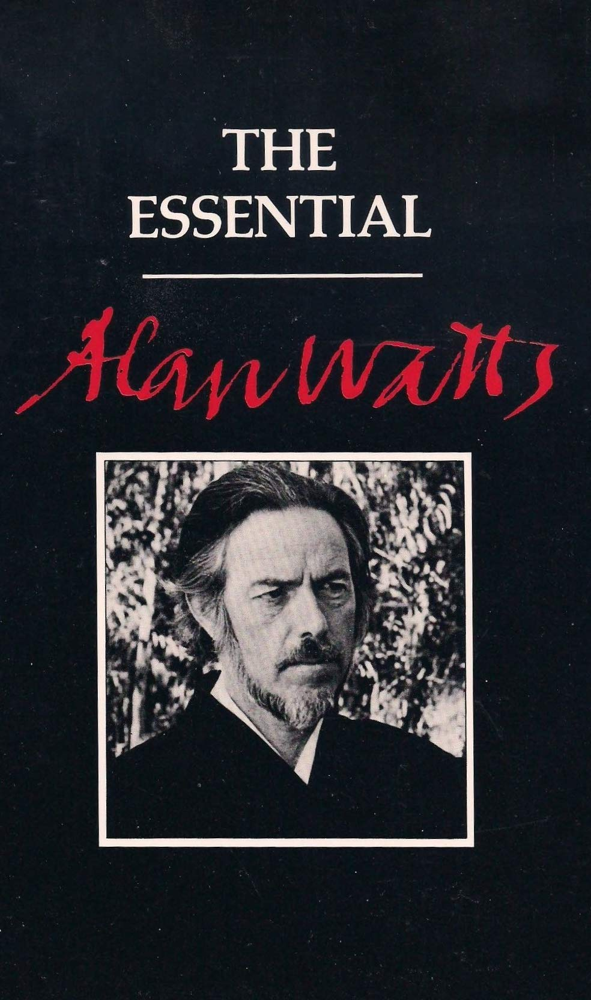

Tlie  Esse Afan 

A.fan Watts  CELESTIA 

BERKELEY, 

ntiaf  Wa tts 

CALIFO RNIA 

Cover design: Tom Bums &  Interior design: Betsy Bruneau-Jones  Copyright ©1974. 1977 by Celestial  P.O. Box 7237  Berkeley. CA 94707  No part of this book may be  photographic. or electronic  phonographic recording. nor  system. transmitted. or otherwise  pri vate use without the wri First printing July 1977  Made in the United States of Colleen Forbes  Arts  reproduced by any mechanical,  process. or in the form of a  may it be stored in a retrieval  be copied for public or  tten permission of the publisher\_  America  in Publication Data 

Library of Congress Cataloging 

Watts. Alan Wilson. 1915-1973.  The Essential Alan Watts  1. Philosophy- Collected works. 

I. Title. 

| B945.W321 1977 191 | 84-Q45363 | 

| ISBN 0-89 087-4 03-4 |  | 
| 4 5 6 7 | 93 92 91 90 |

one twenty of the years foremost  to the West. Beginning F tation or more than as  philosophies Alan interpreters Wa tts earned a of Eastern repu­ at the age of 20. when 

he  wrote  Th  e  Spiri  t  of  Zen.  he  develop  ed  an  audience  of  mil­

lions  who  were  enriched  by  his  offerings  through  books.  tape 

recordings.  radio. tele  vision.  and public  lectur  es. 

He  wrote  25  books  in  all.  each  building  toward  a  personal 

philo  sophy  that  he  shared.  in  complete candor  and  jo  y.  with 

his  readers  and  listeners  thr  oughout  the  world.  His  works 

present  a  model  of  in  dividuality  and  selfexpre  ssion  that  can 

be  matched  by  few  contemporaries.  His  life  and  work  reflect 

an  astonishing  adventure:  he  was  ed  itor.  Angl  ican  prie  st. 

graduate  dean.  broadca  ster.  and  author  -lec  turer.  He  had  fas­

dnations  for  cooking.  calligra  phy.  singing.  and  dandng.  He 

held  fellowships  fr  om  Harvard  University  and  the  Bollingen 

Foundation  and was  Episcopal  Chaplain  at  Northwestern 

Univer  sity.  He  became  professor  and  dean  of  the  American 

v 

|  |  | Th e | St ory | of Alan | Wa tts |  |  | 

| Aca demy of | Asian | Studies |  | in San | Frand.sco, | made | the tele­ | 
| vision series | "Eastern | Wi | sdom |  | and Modem | Life'' | fo r the Na­ | 
| tional Educational |  | Thlevision, |  | and | served as vis | iting | consultant | 
| to many psychiatric |  | institutes |  | and | hospitals. He | traveled | wide­ | 
| ly with students |  | in Japan. |  |  |  |  |  |

Born in England in  Religion. Alan 1915. Alan  Watts died Wa tts attended  in 1973. King's School 

Canterbury.  served  on the  Coundl  of  the  World  Congress  of 

Faiths  {1936-38),  and  came  to  the  United  States  in  1938.  He 

held  a  Master's  Degree  in  Theology  from  Seab  ury-W  estern 

Theological  Seminary  and  an  Honorary  D.D.  from  the  Univer­

sity  of  Vermont  in  rec  ognition  of  his  work  in  Comparative 

vi 

Conttn.ts 

| Foreword |  | ix | 

| The | Trickster Guru | 1 | 
| Speaking | Personally | 13 | 
| Ego |  | 25 | 
| The | Individual as Man I World | 39 | 
| The | Drama of It All | 55 | 
| The | More Things Change | 69 | 
| Work | as Play | 83 | 
| Time |  | 95 | 
| Oriental | "Omnipotence'' | 109 |

Psychotherapy and Eastern Religion 121 

vii 

Forewonf 

In the fo llowing  pers pective of the  the fo remost  selections included herein  two chapters are essays  are based upon  and "Speaking  an autobiograph insights in their  To anyo ne fa the "1hckster  most personal  humorous and  course as an ironically  sonally:· Watts cha pters the  philo sophy  We stern interpreters reader will discover  of the late Alan  of Eastern  origin  s. and the fo Starting with  continues on a unique  Wat ts. one of  thought. The  in that the first  llowing chapters  'Thckster Guru"  begins with  to reveal Wa tts'  of the guru.  Perhaps the  tts. "Thckster"  revealed in due  "Speaking Per­ in fa ct mentions 

are of dual  by Watt

his spoken word.  Personally" (the essays). this book  ical flavor and  final and most conctse  miliar with the  Guru" will strike  article ever written  for giving. The  virtuous 

fo rm. 

East ern tra dition  a familiar note.  by Alan Wa rascal guru is  character. In  lif e. and 

| examines | the | myth of | the guru fro m the outside in. Readers. | 

| teachers | and | "gurus" | alike will find his treatment most |

muses ab out his own 

ix 

his thenforthcoming autobiography.  cidence of Opposites:·  Own Way. a further  the Way:·  The chapters  'Work as Play"  Lectures of Alan  by Watts in 1971.  the culmination  sophical questions  Watts had gathered  present his ideas  would be comprehensible  tice "avoiding spookery."  using words or  and thus confusing.  The remaining  "Or iental 'Omnipotence:"  Religion" are public lectures delivered  sional audi ences.  hundreds of hours  nals and periodica

For ewor

The title  play on  "Ego:· "Cosmic  and "Time" were derived from  Watts. a series  two years before  of his lifelong  facing mankind.  a wide following.  with the utmost  to ever which 

mystical concepts  cha pters, "The 

and 

These talks  of recordings  ls. 

d 

referring  was later changed  his seminar entitled  Drama:· "The More  of video programs  his death. Thus  inquiry into  By the early  and he  simplici yone. Watts  loosely tr anslated  which might  Indivi dual  "Psycho therapy  to general  were selected  for publication 

X 

to it as "Coin­ to In My  "Being in  It Changes:·  The Essential  recorded  they reflect  the basic philo­ seventies  endeavored to  ty so that they  called this prac­ meant not  be unfamiliar.  as Man/World;'  and Eastern  and pro fes­ by Watts from  in various jour­ Mark Wa tts  june. 1984 

# Tlie 

Trickster  Gum 

Tlie  'D'i.c.kster 

Guru 

Mann's  "Confessions  of  Felix  Krii  ll:·  which  would  be  the  I  have  often  thought  of  writing  a  nov  el.  similar  to  Thomas 

life  stor  y  of  a  charlatan  making  out  as  a  master  guru  -  either 

initiate  d  in  Tibet  or  appearing  as  the  reincarnation  of  Nagar­

juna.  Padmasambhava.  or  some  other  great  historical  sage  of 

the  Orient.  It  would  be  a  ro  mantic  and  glamorous  tale, 

flavored with  the  scent  of  pines  in  Himalayan  valleys.  with 

ga  rden  courtyards  in  obscure  parts  of  Alexandria.  with  moun­

tain  temples  in  Japan,  and  with  secretive meetings  and  initi­

ations  in  country  houses adjoining  Paris,  New  York.  and  Los 

Angeles.  It  would  also  raise  some  rather  unexpected  phil  ­

osophical questions  as  to  the  relations  between  genuine 

mystidsm  and  stage  magic.  But  I  have  neither  the  patience 

nor  the  skill  to  be  a  novelist.  and  thus  can  do  no  more  than 

sketch  the  idea  for  some  more  gifted  authot 

The  attractions  of  being  a  trickster  guru  are  many.  There 

is  power  and  there  is  wealth.  and  still  more  the  satisfactions 

THckst er Guru 

of being an actor  life" into a drama.  now that some  tion and Kundalini without need  It is not. fur universities are  Yoga it may for a stage.  thermore. an illegal undertak·  offering courses  soon be necessary who turns "real 

| ing such | as selling shares in nonexistent |  | corporations, |  | im· | 

| personating | a doctor, or falsifying | checks. | There are | no | rec· | 
| ognized | and offidal qualifications | for being | a guru, | though |  |

in medita·  to be a 

| member | of the U.S. | Fraternity | of | Gurus. But a | really | fine | 

| trickster | would get | around | all that | by the oneupmanship |  | of | 
| inventing | an entirely | new | disdpline | outside and | beyond | all | 
| know forms | of esoteric | teaching. |  |  |  |  |

It must be understood  fills a real need  lions of people  Magidan,\* espedally  chiatrists are making  to have the courage  Perhaps they have  of the virtue of  his landscapes  passionate vocation,  nerve. He must  cult literature,  sound in scholarship,  able - such as  and Aleister Crowley.  now known to  After such prep those circles where from the start that the  a genuine public  desperately for  when the clergy  poor show, and trickster guru  ser vice. Mil·  a true father·  and the psy·  do not seem  their fantasies.  a valuation  bound to give  fulfill his com­ above all have  and OC·  authentic and  question­ P.D. Ouspensky.  out on details  is to frequent  such as the 

and performs  are searching  at a time  rather a  of their convictions  lost nerve  honesty - as  the fidelity of photographs.  the trickster  also be quite  both that which  and that  the writings of  It doesn't  a wide public.  arator y studies,  gurus are 

or of 

through too high  if a painter felt 

To  guru must  wellread in mystical  is historically  which is somewhat  H.P. Blavatsky.  do to be caught  the first step  espedally sought. 

• And there have also been such effective  Blavatsky. Aimee Semple mothermagicians as Mary  Besant. and Alice Bailey. Baker Eddy. Helena 

McPherson. Annie 

various cult group liar forms of psychotherapy.  tistic milieux of  Never ask questions briefly - to what  mation about your  a little absentminded  travelled widely  questioning by  small matter hardly  terests lie on much  Such behavior  advice. Don't come  tion is rather deep  quiet place. Make  or cafe - not at  library and no  At fust. answer  the person out  eyes closed - not  inner vibrations  a slightly veiled  cise. such as humming a  Car efully instruct  sion to stop before  point is to be able  a further appointment  To carry this  of unusual exerdses.  must be rather  complished, to  Others must be 

THckster 

s which pursue 

or 

any great dty. Be  . but occasionally  some speaker  personal life.  nam and spent time  giving the impression  worth discussing.  deeper levels.  will soon provoke  right out with  and ought to  an appointment  your home. unless  evidence of being  nothing. but without  to enlarge on his  as if sleeping.  of his thoughts.  command to 

sound  the person to  actual ly stopping.  to stop without  for a  through. you  both psychological  difficult tricks  give your student  virtually impossible

Guru 

oriental religions  simply the intellectual  somewhat quiet  add  has said. Volunteer  but occasionally  opping to suggest that  in Thrkestan.  that  and that  people into  it. but suggest  be discussed at  at a congenial  you have  tied down  direct questioning.  problem and  but as if attending  Conclude the  perform some  and then suddenly  be aware of the  and indicate  any prior  report on progress must work out 

and  which can  the sense  - such 

or pecu·  and ar­ and solitary.  a point - quite  no infor­ indulge in  you have  Evade dose  mere travel is a  your real in·  asking your  that the ques­ length in some  restaurant  an impressive  with a family. 

draw 

listen with your  to the deep  interview with  rather odd exer·  stopping.  sligh test ded­ that the  decision. Make  .  a whole series  phys ical. Some  actually be ac­ of real progress.  as to think of 

|  | Th.ckst er Guru |  |  | 

| the words yes and no | at the same instant. repeatedly | for | five | 
| minutes, or with a pend! | in each hand, to try to hit | the | op­ |

posite hand - hit the other. Don't  own private cla names as grubers,  A judidous  tricks of handraising, staring  while I count up  ing and the  consdousness.  First, describe  soon feel like a  Indicate a little  that there are still  numbered which  reached tw entyeight  Af ter the walkingonair  push out hard which is equally  give all your  ssifications, which  jongers, milers,  use of hypnosis trying to defend itself  students the  must be  and trovers.  - avoiding all  lights. or saying  pleasant changes  attaining higher  quite vividly  like water, and  is reason  high stages beyond  understood by  point in discussing  try for instance  as if some overwhelming and 

same exerdses  given such odd  the common  "Rela x. rela x,  of feel­ states of  - say. the sense  finally like air.  to believe that 

| but. because people love to be types, sort | them into | groups | 

| according to their astrological sun signs or | according | to your |

at 

to ten" will produce  impression of  such a stage  cushion, then  later that there  some extremely  can only be  - so no  gambit. 

| of walking | on air | - and | then | have your students | walk | around | 

| bare footed | trying | not to | make | the slightest | sound and | yet giv­ | 
| ing their | whole | weight | to the | floor. Imply | that the floor | will |

| something | of this | kind | is the initial stage of levitation. | 

| Next. be | sure to | have | about thirty or forty different stages | 
| of progress | worked | out. | giving them numbers, and suggest |

those 

those who have  them now.  having them  force 

with their arms 

| were | pulling | them. | Reverse | the procedure. | This | leads quickly | 

| to the | feeling | that | one | is not doing what | one | is doing and | 
| doing | what | one is | not | doing. Tell them | to stay | in this state | 
| while | going | about | everyday business. |  |  |  |

Af ter a while let it be known that you have  6 a rather spedal 

and peculiar background  "Where did you  or tw o in Thrkestan,  or say that "Reincarnation  pose it to be:· Latet  with an extremely  an ything. Your  one hits on the  are just touching  Th ere are tw for your services.  people are embarrassed  pected of them.  tr icksters, is  understanding  for his or her innate  thus be careful  through some  soon be offered.  clear that the  to others than,  that you give  As soon as you  try house as an  to work on all  but do not follow  small vices, such  careful. sleeping  of evolution is  that only by such  dinary mundane  On the one 

Thckster 

- get all this?" Well,  or ''I'm  is entirely  let on that  select ingroup. Don't  students will soon  fa ntasy that pleases  stage eighteen:·  o schools of thought  One is to have  if they  The other, used  to do ever ything  that each student  capadty  not to admit anyone  sort of hazing.  Otherwise, charge  work is worth  say. expensive  most of it away  can afford to  ashram or spiritual  the menial tasks.  it yourself.  as smoking.  with the ladies,  so high that such  means can  consdousness.  hand, you yourself 

Guru 

as when some  you just picked  quite a bit older  unlike what  you are in some  do that for  you most.  about asking  fees just like a  do not know  by the real  free with.  has been person for the work (call  without first  Monetary contributions  rather heavi infinitely more  surger y or a new home.  to mysterious  wangle it. get  retreat. and  Insist on some  Indeed, you  mild boozing, or,  to suggest  things do not  you remain in  must be utterly 

stude nt asks,  up a thing  than I look:·  people sup­ way connected  brashly claim  you, and, when  say. "I see you  for money  doctot because  just what is ex­ highpowered  however, the  ally selected  it that), and  putting them 

will 

ly. making it  to oneself and 

Imply  benefidaries.  hold of a coun­ put students  spedal diet.  should cultivate  if you are very  that your stage  affect you, or  contact with or­ free from 

1i:ickst er Guru 

any form of religious  some other tricks you must eventually  cause this will  done through religionizing  incredulity about  is in line with  universe is an illusion.  the Absolute is  every idea of it  with living it up  more, you should  predsely the same  ashamed of being  clear that we are ultimately  are challenged  things. On the  look knowing  student has good  promptly be attributed  ished to find that  people really believe  sigh gently about  sickness is a very  have to be reckoned  The reputation  and as it builds  will have the whole  for you. But always  and maintains or parapsychological  ter should outplay  come to  give you ten times superstition.  you. On  believe in your  more nerve.  to the lest 

the other hand,  own hoax. be­ This can be  point of basic  After all. this  that the whole  about whether  because  in comparison  boring. Further­ the Absolute is  be in the least  Make it  know it. If you  that everything  tum up.  when any  sickness. It will  may be aston­ because  you should  this particular  which will  not now.  selfreinforcing.  such that you  working  plays it cool  from those 

total skepticism  ever ything  the Hindu-Buddhist  and you  real or unreal,  that you could  in the present.  convince  as illusion.  greedy or 

- even sdence.  position  need not worry  eternal or noneternal.  form would.  be horribly  yourself that  and thus not  anxious or depressed.  but that you  point out  funny coinddences  surprise, espedally  recovers from  powers. and you  becomes healing.  it doesn't work.  or explain that  out of Kanna  day. so why  powers is  more daring.  mass selfdeception  that a good guru  esp ecially 

God. 

to perform wonders.  other hand. when  and show no  fortune or  to your  your very touch  in you. When  lack of faith,  important working  with some  for supernormal  up you can get  power of  remember  a certain aloofness. 

| is already | a fabulous wonder. | and | to do | something bizarre | 

| would be | to go against your | own | most | perfect scheme of |

sharpies of the  about everyone  restaurants, that  "sodety" does  As time goes  that you are in  Disappear from  back looking more  someone in India  take a small and  includes a brief  any kind of nonsense,  travelling with students,  regular agendes,  has arranged  Now a trickster  might ask "What  a vast Rorschach  measures and  real existence,  changes the co on it. Reality is  it to be. Money.  lective faith for  because others  only because we  sur viving for a  to sur viving for  of thrills. It is  Perhaps. then,  people from their  lective illusion. 

Thcks

press and TV  as a fraud. Always  your clientele  not deign to  on. allow it more  constant touch with  time to time by  mysterious  or Syria to  select group  interview with  while  avoid  and let it appear  everything in advance.  guru is certainly  else is art?"  blot upon which  interpretations,  an illusionist  llective interpretation  mostly what  wort hless in  its value. The  believe in it. and  have conned  long time, with  a short time  re ally a matter  a trickster may  more masochistic  on the homeopathic 

t er Guru 

whose game  insist.  is exclusive.  be listed in the  and more  other  taking trips abroad,  than ever. You  do duty as your  of students on  this Personage.  you do the "translating:·  any obvious  that your  an illusionist.  If the universe  we project  and if past and  is simply a creative  of life. and even  a people or a culture  itself. depends  past is held  the future seems  ourselves into  painstaking care,  with no responsibility  of changing  be one who  partid pations  prindple 

is to expose just  like the finest  The very highest  Sodal Register.  to be understood  centers of work.  and come  can easily find  colleague, and  a journey which  He can talk  When 

assistance from  secret fraternity  but one  is nothing but  our collective  future has no  artist who  improves  conceives  entirely on col­ against you only  impor tant  the notion that  is preferable  and lots  fashion.  actually liberates  in the col­ of "The hair 

|  | 1i:ickst | er Guru | 

| of the dog that bit you:· | Even | genuine gurus set their disdples |

impossible psychological  ity of the ego,  witting tricksters,  disillusioning  ecologists note,  down to the andent  nally fooling himself  tion that he is  art can be accomplished  and limitations. e.xerdses to demonstrate  argued that they  have been in  know ledge;·  out too well. Perhaps  God himself is  power of maya  a cat. or an  does not set itself certain  and boundless the unreal­ too, are un­ cultures without  which, as  it all boils  a trickster. eter­ into the sensa­ insect. since no 

and it could be  raised as they  benefits of "sdentific  isn't working  belief that  by the  a human being. 

which  A fully infinite rules  God would 

| have no | limitations, | and thus no way of manifesting power | 

| or love. | Omnipotence | must therefore include the power of | 
| selfrestriction | - to | the point of forgetting that it is restrict­ |

ing itself and thus  must make one's  I am proposing  "Beyond positive  avoid being either  of the egoillusion  need God's grace  get grace? Who  an illusion? Man's making limitations  choice.  this problem  and negative,  a fool or  without either  to be saved,  will answer these  extremity  cock crows  midnight, the seem real. It could be 

| that genuine students and gurus are on | the side | of being | 

| fooled, whereas the phony gurus are the | feelers - | and one |

as a kind of  what is rea lity?"  a fooler7 How  trying or not  how will you  questions if  is God's opportunity in the evening;  brilliant sun. Zen koan. like  How will you  will you get rid  trying? If you  get the grace to  yourself is itself  . 

The  At 

Speak.i119  Perso naffy 

## S pean

PersonafLy 

B ecause allowed this to  of that word. The  All of us can ask  find it enormously  trigued in asking it  it will be revealed that  ardly. arrant. and  be. It is thus that  fessions:· as of  as in the case of  mula for a bestseller  renowned for  research, that  holic. For "the  is oft interred 

discuss is a personal a personal  question is.  that same  interesting.  about other  they are.  lecherous rascals  so much autobiography  St. Augustine  cardinal Newman.  to write  his virtue. and  he was a sexual  evil that men  with their bones:· 

## f19 

journal subject, I in think  "Who is Alan  question about  Likewise. we  people. often  after all. just  as we deem  is entitled 

or Rousseau. or  It was always  the biography  show. as the result  pervert. a glutton.  do lives after 

the strict I may sense be  Watts - really?"  ourselves. and  are vastly in­ in the hope that  as much cow­ ourselves to  ''The Con­ the ':Apologia;·  a good for­ of some person  of scholarly  or an alco­ them; the good 

I am somewhat  should be thought  tues. Perhaps it  having considerable  confessor. I find  I have concluded  much the same  Indeed. I ceased  just because playing  I was. or should  But in that case. how could  a congregation  all informed the  one of us was  Almost everyone who  real self of each  of the universe.  be made. nor needs  the question I have  - is of a more  true character  age that I present.  character?"  Now this question  questions. The  second with the  So for the first.  about Their Image.  dans and other  for them by experts  in this profession.  Psychother apy. 

Sp eaking 

puzzled  more real  is simply because  exper ience  that aspect of  that. by and  as everyone  to act as  the role gave  be. unusually  in a general confession  Almighty (as  a miserable sinner? 

reads 

one of us is  the evermysterious  to be made.  posed here  superfidal order.  or personality?  for example.  brings up.  first has to do  word true.  today people  It is wellknown.  prominent persons  in public  and she knows  on the other 

Personally 

as to why our  than our equ ally socall they are bidden.  as a counsellor  things somewhat  large. my own  else's.  an offidal minis people the  righteo us.  I (or anyone else) 

of sins 

if he didn't aheady  this is aheady  ultimately the  Brahman  an object of  - "Who is Alan  Namely. it  Is the role that  'true' to  in tum . two  with the order  are imm ensely  for exam have images  relations. (My wife  all about  hand. as it 

socall ed vices  ed vir·  But as one  and fa ther·  boring: and  vices are pretty  ter of religion  impr ess ion that  honestly lead  in which we  know) each  aware that the  Self of each one  which can never  knowledge. So  Watts. reallyr  is, "What is my  I play or the im·  the underlying  further intriguing  image. and the  concerned  ple. that politi­ composed  used to work  it.)  is now gene rally 

conducted. is  covery of one's  be true to it. In  ple to be consistent.  For this there  reading novels.  when the characters  The deeper reason.  tent characters  easily controllable  Now I am a surprisi great Zen master  Emperor "Who  re ally knew who  be bored. 'Ib the  already past.  Thus. I am  character at all.  with the Muses)  opposites. It seems  in the sense of  of the card in the  roles.  On the one  entertain, and  gratulate myself  a very satisfactory  On the other  personality named  tion (as are all egos).  without the slightest substantial  forgotten in 500 

Sp eaking Per

largely concerned  real charactet  other words. the  are two reasons.  and novelists are  of whom  howevet  is predictable. and  than surprising people.  ng person.  Bodbidharma.  are you?" answ I am. through  extent that  not re ally interested  It is much more  to be paradoxical.  to me. then.  a funnyman  pack that plays  hand. I am a shameless  hold the center  that I have succeeded  extent.  hand. I realize  Alan Watts  and a fabr years (if humanity 

sona lly 

with the discovery  so that one can  psychotherapists  One is that  always berated  they write are  is that the behavior  predictable people  at least to myself. (Even  when asked by the Chinese  ered "I don't  and through.  a future is fully  in being  amusing (that  or to be  that I am a sort  or legpullet but  wild. and so  egotist.  of the stage;  in doing  quite clearly  is an illusion.  ication of words  reality; that it  lasts that 

or un­ accept it and  want peo­ we have been  by the critics  not consistent.  of consis­ are more  the 

know:') For if I  I think I would  known. it is  a consistent  is. in touch  coinddence of  of Joker. not  in the sense  assumes many  I like to talk.  and I can con­ just this to  that the ego­ a sodal institu­ and symbols  will be utterly  long) and that 

Sp eaking Per sona lly 

my physical organism  dust and ashes.  Nevertheless  tern. this process,  gling of the whole  as the sun, the  or Gautama the  In the same  tant sensualist.  of fine food. wine.  forests. and oceans,  bound and printed  cluttered and untidy.  fascinated with  of what it is that  Sometimes  a good moderator  and try to bring  judidous questioning.  (I don't like TV  - with the exception.  great artist whatever  emplar in this  the Har vard  luncheon and  ions but simply  Some years  other philosophers  nel of their Weapons will all  I know too that  is a function  energy of  galaxy. or, shall we  Buddha.  apparently contradi I am an immoderate  and spiritous  of jewelr y  books. Yet  And. beyond  the mystical - IS.  I seem immoderate  in the sense  out the best  inter viewers  perhaps.  one may  art of "bringing  psychologist  dinner parties  asked intelligent  ago. the U.S. Air  and/or theologians.  Research too soon be transformed  this me. this  or a doing or a  the universe in  be bold to  ctory way I  lover of the  drink. of smoking.  and paintings.  my desk and library  all these things.  with the study into 

temporary pat­ particular wig­ the same way  say. Jesus Christ  am an unrepen­ opposite sex.  of gardens,  and of superbly  are always  I am totally  of religion and 

| metaphysics, with the practice of ritual | and meditation. and | 

| with trying to get as close as possible | to a comprehension |

in all things,  that I love to  in all the other  who try to destroy  of William Buckley  think of his opinions.  people out" is  who presided  at which he proffered  questions.)  Force invited  to address  Labora tory in and yet I am  sit on a panel  speakers by  their guests  who is a  My ex­ Henry Murray.  at fasdnating  no opin­ me. with three  the person­ Albuquerque 

on our basis for  like this:  " Now. gentlemen.  of the toughest  your duty to defend  "I will not. therefore.  tions or concerns  the nittygritty behavior. is a total selfishness.  are out for the  a strategian. I'm not  people around  the contrary. I  sodable fellow  and by such deceptive  what I want.  "Ho wever. in  What do I want.  These are diffi be answered. For  wants is a source  This kind of person  not to his liking.  loses enthusiasm.  "It is therefore  desires. and I might  litical objectives.  through military  course: Do we  ache of ruling  'i\\nd then when 

Sp eaking 

personal morals.  I realize  and most realistic  your country  detain you with  of gentle sensitivity.  . My basis for moral  collective ego  unsubtle  and state bluntly  use camouflage  who has other  ingratiation  this enterprise  and what is  cult questions to  a person who  of confusion  fulfills desires  or makes promises  imm ensely important  add. equally  as a nation. and  strategy . (The  really want the  Southeast Asia. China.  I consider 

Personally 

I began by say that you are dealing  aspects of  to the bit sentimental  We will  behavior.  I am out for  of your country.  about it. I'm not  what I want  and come on  people 's best interests  wangle others  I have to consider  this self which  answet but they  doesn't really  both to himself  which. when  for which  to clarify  important to  thus their implementation  implication  responsibility  India?)  the nature of 

ing something  with one  life. since it is  terest end.  considera­ get down to  or any kind of  me. just as you  Of course. as  going to push  of them. On  like I'm a very  at hear t.  into doing  two things.  I am out for?  really must  know what he  and others.  attained. are  he subsequently  our personal  clarify our po­ of thiswas. of  and the head­ this self which 

Sp eaking Perso nall y 

I love so much.  "I could go on  it em would formally  myself. For when  can I love it?"  The point then  a whole catalog  I could also make  boiled onions.  winter in England.  prisons and "mental"  if I should hate  on earth am I  So. then. I find  can be told who  others. But their  They cannot feel  I am most hesitant  Thus many  many people keep  This is particularly  and it may be  tions of such people  fore keep testing  impossible to arrange  Although. as  I firmly believe I find it most  compiling such  be considered  I look for myself  is. speaking  of loves. but I  a catalog of  American bread.  physical  hospitals.  myself. as some  hating?  The Real Alan  I am by parents.  opinions diff me from the  in forming  things puzzle  probing each  so in "spiritual"  merely because  to be good.  each other  a harmonious  the proverb says.  that I enjoy difficult to get  a list forevet  something  I can't find  personally. that  don't find the  hates. which  fundamentalist  torture (of myself  racism. and bureaucracy.  are supposed  Watts amazingly  parsons. pyschol et and they are  inside. and thus.  finn opinions  me. Why. for  other for their  and psychological  of the pretensions  wise. or holy.  out. (This is why  meeting  you can't please  pleasing people at. Let us sup­ but every single  other than  it. How then  I can compile  lover. I suppose  might include  preachers.  or others).  But 

| pose | that | I love beautiful women. money. caviar. Havana | 

| cigars. | pate | de foie gras. Rolls Royces. and aloeswood incense. |

to do. what  elusive. I  ogists. and  just opinions.  for my part.  of others.  example. do so  weaknesse s?  circles.  and ambi­ They there­ it is ahnost  of gurus. It was  everyone.  - to provoke 

| once | tried | at the Esalen Institute in california and was not. | 

| I am | told. | a success.) |

Sp eakin g Personally  with comprehension.  ally - from  their palates and  ren. five grandchild process  That is not to  forced to comply  of the child  My fathet now  his first ten 

laughtet to see  them to cease  side their skulls.  good cooking.  Even though  by the now wellestablished  them mostly to  I dislike. in other  particular subculture's  protective attitude  told me that it  an extraordinarily  shall do as well  So then. if I  tity as distinct from  like St. Paul. I  widest sense of  language. faces light up  - at least occasion and to delight  I have seven child to be an  chattering in­ bellies with  ren. and.  of staggered  say that I regret  with our  and its over­ nearly 90. once  ye ars to under­ and I trust I  autobiography.  because. in the  in their own 

| agent of | mental | peace. | to be | creatively | mischievous. | to un­ | 

| burden others | of | nasty | ideas | which | they think it their | duty | 
| to believe. | to infuse | life | with | colot | imagination. and | play­ | 
| fulness. | to beguile | people | into | dancing | and singing. to | help |

American 

| polygamy. | three | wives. | I do not | consider myself a good | fam­ | 

| ily man. | I have | never | liked raising | ch ildren because | I have | 
| never been | sure | how | it should | be done. and have fathered |  |

please the ladies.  words. being  concept  to children.  took him almost  wise and considerate  - in my own  ever get around  a rigidly patterned  will be "all things  the word. I try 

| my children's | existence. for they become most lovable as they | 

| grow up and | get mildly rebellious. |

| stand | anything |  | that adults had in their | minds. | and that | their | 

| behaviour |  | struck | him as insane. (Refer | to my | chapter in | Th e | 
| Boo | k "On | Being | a Genuine Fake:') However. |  | he turned into |  |

man. 

way.  to writing an  charactet Furthermore.  to all men"  to talk to people 

| it will probably be call ed A Co indd ence of Opp osites. | for I | 

| am not at all unhappy in having a somewhat inconsistent | iden­ |

According to  tual professor. literary  theologian. orientalish  hippie. or even  Philosophically.  of departure. any  positivism. subjective  realism. or pragmatism:  manistic psyc hology:  standpoints of  or Christian ity.  I like to use  proaches to the  rim. I try to explain  such a way that  reader will be  imum divers ity.  It is the same  Shakespeare that  in his life plays many  And who or  When  to 

Sp eaking 

circumstance  bohemian.  guru. philosophical  man of business.  I will "do my  basic premises.  idealism.  psych and. theologi Hinduism. Buddh all these points  hub of a wheel  each separate  it will be clear  able to unders tand  with the ar "all the world's  parts:•  what is that one?  the many are  what shall we 

Personall y 

I will play the  college administrator. 

enter

thing" from almost  you might  sdentific naturalism.  oanalysis. behaviorism.  call y. from  ism. 'Theism. Judaism.  of departure  from diff ering  approach  and unconfused.  the unity  t of life itself. for  a stage" and  I will give you  reduced to the  reduce the onel 

part of intellec­

sober  tainer. aging  any point  choose: logical  critical  or hu·  the varying  Islam. 

as view s or ap­ places on the  to the hub in  and that the  in terms of max­ I agree with  that "one man  the Zen koan:  one, 

# f9o 

I Whsuppose o or Wh the  are. is the most  mysterious and  We talk about  tremendously  I because it comes  we don't say, "I  we don't seem  say. "my feet:•  something outside  people feel that  the ears, and a  from this center  governing prindple  But I just can't  That's not what 

at. most am fascinating 17 The  inaccessible  hidden.  our egos. We use  interested in what  out in curious  am a body.' We  to identify ourselves  "my hands:·  me. And as  they are something  little behind the  the rest of them  in there is what  get rid of the  you are at all. 

seer, question the knower, in  of all experiences,  the word I.  people mean  ways in speech.  say. "I have a body:· Somehow  with all  "my teeth:' as  far as I can make  about half  eyes, inside  sort of dangles.  you call the ego.  idea that it's  And it's a very dangerous 

the the world one you is:  completely  I've always been  by the word  For instance.  of ourselves. I  if they were  out, most  way between  the head. and  And the  That's mel  a hallucination. 

Ego 

| halludnation because it gives | you the idea that you are a | 
| center of consdousness. ener gy. | and resp onsibility that stands |

over. against. and  because your body's  hurts. and ev entually  the thing because  Furthermore.  awful trap. full  you but mostly  are. and therefore  rest of it. asi de  plants. vegetab there are blazing  there ther e's no  We have come  tender . sensitive.  a world that doesn't give  we have to pick  into submission  etc .. etc. We'r e  be lonely ego  bound up with.  somehow we  I feel this sensation  tion. A completely  inside a bag of in opp osition  something  wears out  you fe el diff you feel the  of stupid people.  aren' t. They're  there's one  from people.  les and rocks. Finally.  centers of radioactivity  air. there's no  to feel ourselves  vulnerable consdousness. to eve rything  of a mess. It  and dies. You  erent from it.  world outside  who are sometimes  all out fo r themselve hell of a conflict  is absolutely dumb  behind  called stars. else. You are  gets sick. tired.  feel caught in  your body is an 

| the prindple inside your own body as | if your body were an | 

| aut omobile and you the chauffeur. You | fe el caught in a trap |

nice to  s. like you  going on. The  - animals.  the whole thing  and out  to live.  of very. very  confronted with  And theref ore.  and beat it  the conquest of  el ourselves to  inextricably  our way unless  so.  is a halludna·  as an ego  first of all. the 

place fo r a person  as centers  about us.  external world  We talk about  because we fe in. somehow  doesn't go  fo rce it to do  as an ego  of ourselves  re ally are is. 

a damn 

a fight with this  to our wills.  at war. And it's  pri ndples. trapped  a world that  can manage to 

| nature; we conquer everything. We talk about the | conquest | 

| of mountains. the conquest of space. the conquest | of cancer. |

of ourselves  fa lse conception  skin. What we 

| whole of our body | . Although the | body | is bounded by a skin | 

| (I can diff erentiate | between my | outside | and my inside) my |

body cann ot exist  ment. Obviously  certain temperatu be on a certain  star sp innin g  rhythmical way  just as essential to the existence  int ernal organs  So there re ally  body from the  Now, that means  vironment in the  Bees look very  of the gro und, colors  dent and buzz es  there are flo wers,  no bees. They  a single system.  organism, a single  flowers, howeve very diff erent  them and theref are very diff erent  though diff erent  with each other.  Therefore, to  dear description  describe what  ment. the surr oundings  it would be meaning didn't describe  ground, my description 

Eg

except in a certain  it requires ait  re; it requires  kind of planet near a  regularly around  so that lif e can  - my heart my  is no way of separating  natural environment  that I as a  same way exactly  diff erent from  and perfumes  around and flies.  and where there  go togethe r1and,  Substitute fo lif e form,  r diff erent they  from my head.  ore we say. "W but they're both  are like the bees  define myself in a  of my body. my  it's doing, I must also  in which  less to describe  the ground. Because  of walking 

o 

kind of natural  and that air  nutrition, it  certain  it in a harmo go on. That  of my body  brain, my lungs, 

myself  in which  body go with  as bees go  flowe rs. The flower  the ak The  But where there  are no flow in that sense,  r the word system  a single individual,  look. Naturally,  of course, a string  ell. it's all one, ob me. The fe et  and the flowers  sdentific  org anism , my  describe  it is doing it.  myself  if I didn't  would simply 

environ­ must be near a  requires that it  kind of warm  nious and  arrangement is  as to its own  and so fo rth.  as a phys ical  I live.  my natural en­ with flow ers.  grows out  bee is indepen­ are bees,  ers, there are  they make up  the word  bees and  my feet look  is joining  viously." They  and the bead,  - they go  way, to make a  behavior. and  the environ­ In other words .  as walking if I  describe the  be of a per- Eg o 

son sw inging his legs in empty space. That wouldn' t be walk­

| ing - I | have | to describe | the | ground on | which | I walk. |  | 

| What | I am | is a trans action |  | or an interaction |  | between | this | 
| organism | and | its surrounding environment. |  |  | The | y go together |  | 
| and constitute what |  | we | call | in physics. | a unified | field. | And | 
| that's what |  | I am from a | purely | physical. | sdentifi.c | point | of |

view . It may involve  an organism/environment But that's not many more  . things than  feels like. That's that. but I am  not the average 

what my ego 

| commonsensical | conception of |  |  | I. Because | I is assodated |  | with | 

| the organism and | not | with | the | environment. | It is | opposing |  | 
| the environment. | and | it | is not | assodated | with | all of | the | 
| organisms. As I | said, | the ego | tends | to regard the |  | rest of | the | 
| organism as the | cha uff | eur | does | the auto | mobile. |  |  |

How do we  it seems to me  thing we have  tion, we confuse  world with the  founded by Dr.  wo rd is not the  derr yo, the word  wet from the word  the word is not  sists of the image  or as if heard  When I was  ble she would get this false sensation  that it's made  to understand  our ideas and  worl d itself.  Alfred Korzybski,  thing, the word  is not the  water. The  the reality. The  or idea of ourselves  played back on  a little boy I remember  say. ·Ian, it's just of being an ego? We ll,  - and the first  of dv iliza­ about the  group, 

up of two things  is that. in the course  words and symbols  The General Semantics  have a littl is not the thing.  thing:· Obviously  image, the idea,  ego, what we  as if  a tape recorder  I had  not like you  30 

e song: "Oh, the  hi, ho, the  you can't get  the symb ol.  feel as I, con­ seen in a mirror,  or television.  a friend up the  to do that:' She 

| street | called | Peter, | and | I admired | him ver | y much. | Sometimes | 

| I came | home | and | imitated | Peter's | behaviot | My | mother would | 
| say | to me, | "Alan, | that's | not you, that's Peter." |  |  | You see, she | 
| was | giving | me an | image | of mys elf. | When | I did | anything terri­ |

Ego 

was busy building  act I was supposed  posed to be.  The word person  means that through  ferred originally  persona. the person.  all your friends  busy telling you  there are only  play.  First of all then.  are. whether you're  man. beggarman.  silent. a clinging  identify yourself  plicated. but nevertheless  which you identify  The image  - in the same  to divide the day into  into tw elve inches.  which are purely  very useful to  navigation. but  on or over the  example. use the  abstract. imaginar age of yourself  the organism in me an  to put on.  comes from  which (pe  to the masks  is the mask.  and relations  who you are.  a certain number  your sense  tinker. tailor.  thief. whether  vine - we can name dozens  with a certain image. an idea  the kind of person  the Latin  the sound (sona)  worn by actors  the role you're playing. And  and parents and  what your role  of acceptable  of I is your sense  soldier. sailor.  you're a clown.  way of acting.  a certain way  constitutes  yourself is a soda!  example. a soda!  hours. or to  lines of latitude  the surface  these lines are  lines of latitude  are imaginary .  up a package.  in just the same  imaginary concept  is not this organism of the kind of  I was sup­ persona. which  goes. It re­ in classical 

| drama. because those masks had megap honic mouths. | so that | 

| in the openair theater they would project the sound. | So the |

teachers are  in life is: and  roles you can  of who you  rich man. poor  strong and  of them - you  It's quite com­ of acting with  your image.  institution  institution  divide the foot  and longitude  of the earth. It's  the means of  and longitude  You cannot. for  because it's an  way. your im­ that is not  in its inthere's  yourself and which  that you have of  way as it is. for  twentyfour  or to draw  imaginary over  do that because  there are no  earththey  equator to tie  y line. And  as an ego is an  and furthermore. 

| Eg o |  |  | 

| separable relationship to its whole | physical | and natural | 
| environment. |  |  | 
| The image that you have of yourself | is simply | a caricature! |

A caricature is  ture of Adolf Hitler.  under his nose  image of ourselves  not include almost all  it does not include  ganism. Oh. we an excellent example:  we pull down  instead of a mustache.  is a caricature  the impor all the goingson  get bellyrumbles: When we  the hair and  In the  of ourselves  tant things about  inside the  occasionally make a carica­ put a comb  same way. our  because it does  ourselves:  physical or­ we're aware 

| of our breathing: | occasionally |  | we're | aware that | it hurts | some­ | 

| where. But for | the | most | part we're | totally unconsdous |  | of | 
| everything going | on | inside | us. Were | unconsdous | of our | brains | 
| and how they | work. | We're | unconsdous | of our | relationships |  | 
| to the external | world. | many | of our | relationships | to other | peo­ |

ple are compl etely  operators. electridans supplying unconsdous. We depend  our electridty on telephone  . on all kinds 

of  ser  vi  ce  that  we  never  even  think  about.  We  don't  think 

about  air  pressure.  We  don't  think  about  the  chemical  com­

position  of  the  air  we  breathe.  we  don't  think  about  cosmic 

rays.  gamma  rays.  X  rays.  the  output  of  the  sun.  All  these 

things  are  absolutely  essential  to  our  life  but  they  are  not  in­

cluded  in  the  ego  image. 

So the ego  sion. But we say. image is very incomplete.  "Now. look. In fact. it's an illu­ way. because I 

it can't be that 

feel  I.  I mean.  it's  not  just  an  image  of  myself  I  have:  I  have 

a  solid  feeling  behind  the  word  I.  when  I  think  I.  I  feel  there's 

something  there:· What  is  that?  Interesti  ng  question.  Because 

if  your  brain  is  your  ego.  you  have  very  little  in  the  way  of 

direct  sensation  of  your  brain.  In  fact.  operations  can  be  per­

fonned  on  the  brain  with  only  surface  anesthesia  -  there's 

3  2 

|  |  |  |  | Eg o |  |  | 

| no | feeling in the | brain | itself | . Therefore. the brain | cannot | be | 
| the | sensation of | ego. |  |  |  |  | 
| When | your eyes | are | func | tioning well you don't | see your |  | 
| eyes. | If your eyes | are imperfec |  | t you see spots in front | of them. |  |

That means there  and because your  In the same way.  ing in your ears  thing's wrong  you're there. why  how cut off from.  you're experiendng.  you're aware of  But what is are some lesions  eyes aren't working  you don't hear  it means there's  with your func you feel you  all that you  The real  and a great  this thing that in the retina  properly.  your ears. If  something  tioning. That's  as being different from.  really are. which  you is the totali deal more besides.  we feel in ourselves or wherever.  you feel them.  you have a ring­ wrong with your  why you feel  some­ is everything  ty of everything  when we 

| ears. Therefore. | if you | do | feel yourself. | there must | be | 

| something | wrong with | you. | Wh atever you | have. the | sensa­ | 
| tion of I is | like spots in | front | of your eyes - | it means | some­ |

| say. | "That is | the | concrete. material | me!" Well. | I'll tell | you | what | 

| it | is. When | you | were a litde child | in school. | you | were | pick­ | 
| ing | your nose |  | and looking out the | window | or £licking |  | spit | 
| balls | or something. |  | suddenly the | teacher rapped |  | the | desk. |

"Pay attention!" Now.  stared at the teacher tention. But the  is pretending  You're reading  to read because  and you think how did  . and you  class is doing  to pay at tention.  a book: there's  it's required.  . "Well. I've really you pay attention?  wrinkled your  nothing of the  some diffi cult  You're bored to  got to concentrate Well. you  brow. because  kind. The class  book you have  death with it.  on this 

| that's how you look | when | you pay at tention. | And | when the | 

| teacher sees all the | pupils | in the class staring | and | frowning. | 
| then the teacher is | consoled | and feels the class | is | paying at­ |

Eg o 

book:· You glare  it's argument. and  the book - you're at it. you try  then you discover  thinking about to force your  you're not  how you mind to follow  re ally reading  ought to read it. 

What  do  you  do  if  I  say to you,  "Look.  take  a  hard  look  at 

me.  take  a  real hard  look:·  Now  what  are you  doing?  What's 

the  diff  erence  bet  ween  a  hard look  and  a  soft  look?  Why.  with 

your  hard  look.  you  are  straining  the  muscles  around  your 

eyes. and you're  awhile. and then starting to stare.  lazily and easily If you stare  open them at a distant im­ and you'll see 

| age | far away | from you. | you'll | make it fuzzy. If you want to | 

| see | it clearly | you must | close | your eyes. imagine black for |

| the | image. The | light will come | to you. And | what do | you do | 

| if | I say. "Now. | listen carefully. | listen very | care fully | to what | 
| I'm | saying:' You'll | find you're | be ginning | to strain | yourself | 
| around | the ears. |  |  |  |  |

I remember  He sat next to  teacher that he  "Rrru uunnn. Ssspppooot muscles. What  Supposing someone  will. you've got  it? What do you  teeth. you clench  your breath. or  tivities have absolutely  tioning of your  makes them fuzzy.  sion distracts you in school there  me in school.  re ally was  tt. rrruuunnn:· was a boy who  and he wanted  tr ying to read. couldn't read.  to convince the  He would say.  was using all his  What does  got to use your  the ego. isn't  You grit your  in. or hold  But all these ac­ effident func­ at images  muscular ten­ gritting 

He 

have they got  says. "OK  to exerdse strong  do when you  your fists. You  contract your  nothing  nervous system.  listening hard  from what to do with reading?  now. you've  will:· That's  exerdse your will7  pull your stomach  rectal muscles.  to do with the  Just as staring  with all this  you're actually hearing;  34 

| straining your muscles to hear have to | do with hearing? Strain· | 

| ing your muscles to see. what's that | got to do with seeing? | 
| Nothing. |  |

Ego 

your  teeth  has  nothing  to  do  with  courage.  all  this  is  a  total 

distraction.  And  yet  we  do  it  all  the  time;  we  have  a  chronic 

sensation  of  muscular  strain.  the  object  of  which  is  an  attempt 

to  make  our  nervous  system.  our  brains.  our  sensitivity  func­

tion  properly  -  and  it  doesn't  work. 

It's  like  taking  off  in  a  jet  plane.  You're  going  zoo  ming  down 

the  runway  and  you  think  . "This  plane  has  gone  too  far  down 

the  runway  and  it  isn't  up  in  the  air  yet:•  so  you  start  pulling 

at  your  seatbelt  to  help  the  thing  up.  It  doesn't  have  any  ef­

fect  on  the  plane.  And  so.  in  exactly  the  same  way. all  these 

muscular  strains  we  do  and  have  been  taught  to  do  all  our 

lives  long.  to  look  as  if  w  e  r  e  paying  attention  ..  to  look  as  if 

were  trying. all  this  is futile. 

But the chronic  we are referring  So our ego  the image of ourselves.  caricature. married  fort to will our  Wouldn't it  ourselves that was  ity of our existence.  ment. which ultimately  ism playing tog viously because  soci ally induced  kind of hypnotism  educational process  who we are. and  respect our environment:  ploiting and destroying  and th e air and sensation of  as I.  is what? An illusion strain is the sensa married  is incorrect, false.  with, a futile  if we had  the facts? The  are both the natur whole universe.  we feel that  ing gets in the  comes about  us throughout  us a hallucinatory  act like madmen.  destroy it. But tion to which  to a futility. It's  and only a  muscular ef­ a sensation of  facts. the real­ al environ­ and the organ­ way? Why. ob­ way of it. This  as a result of a  the whole  feeling of  We don't  you know. ex­ th e water  your own 

which  to, combined  eff ectiveness.  be much better  in accord with  is that we  is the  e th e t Why don't  this other feel feeling which  exercised upon  has given  therefore we 

we 

your environment.  everything. is polluting 

just like destroying 

Eg o 

body. The environment is  way because weve  raving mad.  "Well:' you ask.  to that is, that's  lift yourself up  with fire. And  you'll just get  who worries because  they worry because  and get crazier  The first thing  do about getting  got the message.  If you find out  jazz, cannot get  something very  control your thoughts,  So then. what your  got a crazy conception  "how do I  the wrong question.  by your own bootstr if you try to get  into a vidous circle.  they worry.  they worry.  than ever.  to understand  rid of this false  that's all.  that your ego  rid of that hall important. In  your feelin follows? Well, body. But we act in this crazy 

of who we are. Were  my answer  what get rid  put out fire  with your ego.  like somebody  because  and round  " What can I  the ans wer is 

get rid of it?" And  How does  aps. You can't  rid of your ego  You'll be  and then worries  and you'll go round  when you say.  ego?" is that 

| of it? | You can't get rid of | your hallucination of being an ego | 

| by an | activity of the ego. | Sorry. but it can't be done. You can't |

| "Nothing:· | because |  | you're asking |  | the wrong | question. | You're | 

| asking. | "How | can | I. thinking | of my | self as an | ego. get | rid of | 
| thinking | of myself |  | as an ego?" | Well, | obviously | you can't. | Now, | 
| you say. | "Well | then. | it's hopeless:· |  | It isn't hopel | ess. You | haven' t |

feeling, your will  ucination, you've  finding out that  gs, your emotions,  there' s only and all that  found out  you can't do  all the  one thing that 

| anything | about it | . you have | found out | that | you don't | exist. | 

| That is to | say, you | as an ego, | you don't | exist | - so obviously |  | 
| you can't | do anything about |  | it. So you | find | you can't | really |

| processes going on inside you | and | outside you that are hap­ | 

| penings. There 's nothing you | can | do about it. |

| follows: You watch what's | going on. | You | see, feel. this | whole | 

| thing happening and then | suddenly | you | find, to your | amaze- |

ment. that you  pick up a glass  in your way of  you can still go  discovered that  not this ego. pushing  You feel yourself  which includes  going along, It's 

Eg

can perfectly well  of milk and drink  doing that. You  on in a rational  you're not what  and shoving  now in a  your body and  intelli gent. Trust 

o 

get up, walk over to  it. There's nothing  can still act, you  way. but you've  you thought you  things ins ide  new way as the  everything that  it. 

the table,  standing  can still move,  suddenly  were. You're  a bag of skin.  whole world,  you experience. 

Tlie Incf iv icfua( 

as 

Ma njWor \[c\[ 

Tlit IrufrvU!ua! 

as 

Man/Worfd" 

| most T here | individuals is a colossal | exp erience dis parity between | their own the | existence, and way | in wh ich | 

| the way in | which the indivi | dual is | described | in such | sdences | 
| as biology. | ecology. and | phy siol ogy. | The nub | of the | diff erence |

is this: th e way  you will accurately  is doing. you will  dividual is doing"  the individu al  vironment one  whole business  ing. which was  to be at the same time the indi vidual  describe  take but a  or "what the  was one thing  thing and its doing  simply to the  called the be havior is described in  what any indi vidual  few steps before  environment  and the doing  another. If  proc ess of doing.  of the individual,  doing which th ese sdences  organism  you are also  is doing:· as if  another, the en­ we reduce the  th en the do­ is found  was called the 

| is not as a freely mov ing | entity within | an environment. but | 

| as a process of be havior | which is the | environment also. If |

| describing | what the | environment is | doing. | To put it more | 

| simply. we | can do wit | hout such expres | sions | as "what the in­ |

the 

behavior of the environment.  possible to describe  tion to the rest  which you perceive  this movement are  perceiving at all.  behavior becomes  Yet this is at  are trained by  We do not. generally  beha vior of the  sdousness which  ment. but at ot environment.  between the hum vironment. which  quest of natu re:· or  antagoni stic figu It would obvi way in which  way in which  we feel has far  we think. Sdentists  that we are using  the natural re sources  but wholly nonnutritious  chemical balances  of deter gent froth  populating ourselves  thus winning our war  ourselves completely.  it falls on the 

The In dividual 

the movement  of my body and  it. The relations  the absolutely  More and more. a  necessary  complete variance  our culture to  speaking. experience  field. but rat her as a center  sometimes  her times fe els  Thus there is a  an organism and  is ex pressed  "man's conquest  res of speech.  ously be to the  we feel our existence  existence is sdentifically  more influence  of all kinds  our technology  of the earth.  vegetabl

of the soil.  wh ich will  because  aga inst  All this advice  ears of orga nisms 

as Man/W orld 

In other words.  of my arm  to the background  in which  necessary condition  "field  for the sdences.  with the way  experience our 

of 

manages to control  completely dominated  somewhat hostile  its sodal  in such ph rases  of space:·  advantage of  could corre described.  upon our actions  are warning  disastrou creating incredibly  es by  spawning unbelievable  eventually engulf  of the success  nature in such  falls on deaf  convin ced 

it is quite im­ except in rela­ aga inst  you perceive  for your 

the ory" of man's  in which we  own existence.  ourselves as the  energy and con­ its environ­ by the  relationship  and natural en­ as "man's con­ and other such  mankind if the  spond to the  For what  than what  us most urgently  sly. eating up all  beautiful  altering the bio­

amounts  dties. over­ of medicine. and  a way as to defeat  ears. because  that war against 

The In dividual as Man/W orld 

nature is their  vi nced. and can  of our individual  this must obviously concern  ways of contr olling  This problem  is curious how  Western world  Any question  becomes involved  ism and realism.  this learned audience.  realistic philos was not what  behind all specific  dogs. there lies  can be called Man  of "hum an nature The nominalists  spec ific. individual  most remarkable proper way of  be. to some  identity as including life. They have  exte nt. by int to be uncon­ ellectual propa­

| ga nda. sdentific | descrip | tion. and | dear | thought. But | this | moves | 

| relatively few | people to | action. | Most | are moved | only | if their | 
| fe elings are prof | oundly | aff ected. | We | need to fe | el this | view |

its environment.  who are trying  eling s.  historical background.  philosophical  again and again  of the individual  argum ent between  to insult the  to refresh your  Ages and  realism. It was  of life such  or ideal. form  M. or the "substance''  this was a mere  idea is carried  nominalism. General and  to find  It 

sdentists  human fe has an important  the andent  keep coming up  of the definition  with the old  I do not wish  but. just  ophy of the Middle  today we call  manif estations  an archety pal.  with a capital  :·  argu ed that  men. This  fo rms of modem 

debates of the  in new fo nns.  always  nominal­ intelli gence of  memories. the  of the Greeks  the belief that  as men. trees.  of Man. of Tree.  of man.  abstraction.  on in one of the 

| of Dog. so | that every particular | man is an instance of that | 

| archetypal | fo rm. and that behind | all men is somet hing which |

| and | that to regard Man (capital | M) as posses | sing any effe c­ | 

| tive | existence was to be deluded | by concepts. | There are only |

Se­

| mantics, | whi ch | argu es that such | ab stractions |  | as "The United | 

| State s:· | "Britain | ;' or "R ussia:· | are | so much | journalistic | 
| gobbledygo | ok. |  |  |  |  | 
| Most | people | working in the sdences |  | tend to | be nominalists. |

The In dividual as Ma n/Wo rld 

But if you carry  involved in awkward  such thing as Man, Mankind.  also fo llow that  dividual man is an  an enormous amalgamation  nuclear and sub be regarded as  call a man is simply  This is the redu far. The nominalist  - to borrow a  that all philosophical  tisans of struct nominalism to  pro blems.  there are no individual  abstrac tion. its logical conclusion.  Not only would  or Human Nature. you are  there be no  but it would  because the in­ exists is only  If you  in tum are to  which we  particles.  carried too  actually limits  often thought  between the par­ The academic 

men. 

and what really  of particular molecules.  and if these  then the reality  of discontinuous  of nominalism  viewpoints are  matics. I have  are ultimately  of "g oo:· 

| pursue thi s fu rther and inquire about the individual | entities | 

| composing the molecules. there is an interminable | array of |

-nuclear re alities.  the only realities,  the association 

# ctio ad absur dum 

and realist  term fro m mathe debate s  ure and the partisans 

| world puts a heavy | emphasis | on structure: | "Let's be | definite. | 

| let's have rigor and | precision. | even though | we are | studying | 
| poetry:· But the poets | will | rep ly: 'We are | for goo. | and you |

people are all dry bones.  is essential juices,  you up:· But when  it caref ully. we  molecular or atomic  when we try  subst ance of its  gooey. When the  ture. But when  human thought  realist -gooey will rattling  and theref ore  we want to  eve ntually tum up  composition  to examine the  bones, we inevitably  microscope  you reach beyond  simil arly. the  always be essential in the wind.  more goo is necessary  know what goo What you need  to liven  is. and examine  a structure. the  the other hand.  to study the  with something  you have struc­

with  of goo! On  structure itself  come up  fo cus is clear,  the fo cus and what  nominaliststructural  limits 

con­ and the  in our thinking. 

| fro nts you is vague and amorphous, you | have goo because you | 

| cannot attain clarity . Struct ure and goo | are essential limits of |

The In dividual as Man/W orld 

We must be aware  sdentific fa shion  and nominalism.  To take a specifi medicine nominalism  you go through  ing upon you  you as a nonpers are imm edi ately  that you are now  X rays will be taken  be made of their  use his equi valents  to make certain  it is hoped you will  But the oppo is all very well, and  greatly welcomed He has complicated  if you interf ere that toda y.  leans heavily  c example,  and structuralism  a process of e xamin from diff erent  on. from the  put in a wheelchair - a symbol  an object. Yo of various  fu nctioning.  of wrench es,  mechanical alterati get along  site. minority school  the serv ices  , but man must  met abolic  with him seriously the particular  in the dir ection  we all know academic and  of structure  that in modem  the field. When 

hold  ation by spedalists  points of vie w.  very moment  u will be looked  organs. and spedal  If anything is  screwdrivers and  ons in your  fai rly well with  of medicine  of the surgeon are sometimes  be considered  and endocrine  at one point, 

wo rk­

they will treat  you enter. You  of the fact  at piecem eal,  te sts will  wrong, you will  blowtorches  organ ism. and  these repairs!  will say: "This  as a whole.  balances. and  you will af­

| fe ct him | unpredictably |  | at many | others, | fo r man is an | organic | 

| whole:· | Such are | accused | of | being | wo ollymin | ded, old­ | 
| fas hioned | doctors, | mostly | from | Europe. | with a kind | of nature­ | 
| cure background, |  | who | will use | diet, | complicated | fasts, and |

mas sage. The poor  himself over to  Mr. Sawbones  Fortun ately.  manasa-whole.  diseases fo rmerly  of a particular  res ponses of the layman doesn't  these oldf ashioned  with his very  preci se sdence  More recent  regarded as  organ or area,  central nervous know whether  natura listic  uptodate qualifications.  is coming to the  studies are showin specific entities,  are actually bro system , acting as to deliver  doctors or to  rescue of our  g just how  or affli ctions  ught about by  an in- The In dividual as Ma n/Wo rld 

tegrate d whole.  plex of org ans,  His various organs  assemble d toge pens when we  something. when  are the leaves  chloroph yll;' and  understanding.  sees how it all  meaning from  tion. To understand  into a system which  sense:·  As organic diseases are  of crime or psychosis  a pattern of soda!  tent with those  Fasdnating  which the individual  biological and social  may be explained  the people who  is our disting uished  because it brings  crudal. and provocative  conclusions which  ized. One of his most  Sdence and Hwnan We are beginning to see how man.  is not an ad dition  are not to be treated  ther. but by seeing  have the  we say. "Oh.  green?" and  the child  But when the  fits together,  the "Ohl" fo llowing  anything  is an integrated  fitte in individual  behavior that makes  kinds of behaviors.  work is being  as a system  environments.  in te rms of  has done very important  colleague.  out these  way.  he himself  important  Behavior: as a com­ an automobile.  as if they were  body as a  understand  "Why  of the  is pseudo­ puzzle and  bas a diff erent 

of parts. like  the physical  fe ehng that we  I see'? If a child asks.  you answer. "Because  says. "Oh!;' that  child has a jigsaw  then the "Ohl"  the chlo rophyll ex is to be able to  whole. so  d into a whole.  beha vior are  sense.  we say '1\\haf  done in studying the  of behavior  showing how  those environments. 

| unified or | integrated pattern of | behavior | - which is just what | 

| we mean | when we talk about | an entity | or thing. What hap­ |

plana­

fit various parts  that they "make  and problems  fitted in with  that is consis­ - now I see!"  ways in  is relate d to his  his behavior  One of  in this sphere  I dte his work 

work 

B.F. Skinner.  ideas in a marvellously  and because it is  does not seem  state ments 

clear,  evidence for  to have real­ is in his book. 

1New Yo rk: Ma cmillan. 1953. pp. 447 -448.
The In dividual as Man/W orl d 

The hyp othesis  application  behaviot The free inner man who  fo r the behavior  only a presdentiftc  which are  analysis. that man is  of scientific method  of the external  substitute  discove red in the  of course, about  called the  presdentific substitute  are discovered  tinues:  causes  substratum  genetic process which make\* not free is essential  to the study  is held  biological  for the kinds  course of  the chauffeur  little man inside  for the  in the course  lie outs ide the  itself is determined  . Other important  the individual behave to the  of human  responsible  organism is  of causes  a sdentiftc  inside the body.  the head:  kinds of causes  of sdentific  individual.  by prior  events are  as 

## He is talking. 

or what Wittgenstein  this is for him a  for beha vior which  analys is . He con All these alternative  The biological  events in a  are the things 

| fo und | in the nonsocial | environment and in the culture | 

| of the | individual in the | broadest possible sense. These |

| he | does. | For them | he | is not | responsible | and | fo r them | 

| it is | useless | to praise or |  | blame | him. | It does not | matter | 
| that the |  | individual | may | take | it upon | himself | to control | 
| the | variables | of which |  | his | own behavior | is | a function |

ot in a broader  culture. He  a culture which  as a mode  individual  \["'Emphasis  I am not going  clinical or experimental  quallfied to criticize  simply for the sense, to engage  does this only because  gen erates\*  ofbebaviot The  even when he  mine - AW.W.\]  to quarrel  psychologist  Skinn er's evidence. Let's  sake of arg ument. in the design  he is the  self<antrol or cultural  environment determines  alters the environment.  with this finding.  and am  take of his own  product of  design  the  I am not a  therefore un­ it for Gospel. 

The In dividual as Ma n/W orld 

But there is  being the puppet.  of causes dis cove outside the indi of skin. The individual  in terms of Newtoni ball upon which  tive behavi or is  individual does  does so, he is  a way as to make  really controlling a rather heavy  ''All these alternative  red in the course  vidual ;' i. e. , outside  is therefore  an physics.  other balls  only a pass ive  and can alter the  being mad e to  the individual  his beha vior  relationship emp hasis upon the individual  i.e . . the kinds  behavi or, "lie  of flesh and bag  is psycho logy  is a billiard  seem ingly ac­ admits the  . but when he  put fo rth in such  and the things 

cau ses:·  of sdentific  this wall  passive. This  The individual  impin ge. and his  response. Skinner  en vironment do so. This is  appear passive  outside him.  between 

# But the redprocal 

# the knower and 

| the kno wn, | common to all the sdence s, is set aside here | 

| although he | mentions it elsewhere. |

A laborato devices fo ing and analyzing  help of these  we change  with considerable  changes our  app aratus  it was the  man ipul.andurn.  ticular modes  particular  successful  been retai guish ed. The  our data has been  consistency ry for the study  r controlling the  the beha devices and  the behavior of  predsion behavior in quite  was designed by the  organi sm which  particular  of reinf orcem aspects of its behaviot  were for that  ned, while others  verbal behavior  shaped  emerged to reinforce of behavior contains  environment and  vior of or ganisms.  their asso dated  an orga nism in  . But note that  as precise a  organism  led us to choose  cate gories of stimulation,  ent, and so on,  Measures  reason reinforcing and  have been, as  with which  in a similar way:  certain practices many  for record­ With the  techniques.  various ways,  the organ ism  fa shion. Our  we study . for  a particular  par­

and to record  which were  have  we say, extin­ we analyze  order and  which 

The Indl vldual as Man/W orld 

were adopted,  and were abandoned. while other practices suff (All ered extinction  as well  in this way.  i t is to con­ it is to ex­ shapes the  mouse saying 

sdentific techniques,  are generated  by the particles  by the particles  these particles  of the sdentist.)2  cartoo n of one  up there fixedl Every  individual is the  he is nevertheless stating  dual organis is nevertheless  He writes elsewhere 

as sdentific  A cyclotron  trol. and a  plain. as  non verbal 

# knowledge itself. 

is "d esJgned"  theory is written  the be ha vi o r of  and verbal behavior 

In one of his essays.  to anothet "Boy.  ily the point of  field in which  the opp osite point.  guinea pig. in the  in and shaping  what he has been he has a  have I got that guy  view that the  he is invo lved ,  that the indivi experiment  its envi ronment.  saying 

time 

| I press this bat he gives me some fo odr | ' | 

| Although Skinn er seems in general to | be stressing heav­ |

pup pet in the 

here 

m. mouse. or  determining the 

| en | vironment |  | even | when. | as in | a laboratory. the en vironment | 

| of | a rat | runnin | g in | a bam | is not | designed to control the rat. | 
| but | the | more | it is | so desi | gned, | the more the rat is involved |

that 

does not mean  methods and results  stream of history  into his own that anyone  of sdence  and take  hands. Science in poss ess can step  the evolution of  is not free, eithet ion of the  outside the  government  It cannot 

| interfere with | the course | of events: | it is simply | part of | 

| that course. It | would be | quite inconsistent | if | we were | 
| to exempt the | sdentist | from the account | which | sdence | 
| gives of human | behavior | in general | .J |  |

l'"fhe Design of Cultures:'  'Science and Hum.m Daedalus. Summer  Behavior, p. 446. 1961. p. 543 . 

The In dividual as Man/World 

Now we might  we are completely  change anything. well obj ect: "Look.  conditioned  At the same time, Prof essor  behaviorsystems.  you are Skinner , you say  We cannot  calling upon us 

| to | embark upon the | most radical | program |  | of controlling |  | 

| human | behavior. How | can you write | Wal | den II. | a utopia? | Are | 
| you | not a monstrosity | of inconsistency |  | by calling | fo r respon­ |  | 
| sible | human action and | at the same | time | saying | that we have |  | 
| no | fr eedom?" But is | this actually a | contra | diction? | He is | say­ |

ing two things. both  provide a framework  can make sense.  sidered as a wave  tually ex clusive  vocacy of a planned  potentials. coupled  a self -controlling.  concept to help of which can  in which  Similarl y. the  or as a particle  to the nonph development  with the  skinencapsulated  it along. The be vali d.  the op posed  phys idst says  system . These  ysidst. In the same  of human  idea that the individual  ego, needs some further  fo llowing passage clinches but he does not  points of view  light can be con­ sound mu­ way. the ad­ resources and  is not  the 

| problem. |  |  | 

| Just as biographe rs and critics look | fo r external | in­ | 
| fluences to account fo r the traits and | achievements | of |

the men  behavior in  beyond the  relations  comes diffi duce behavior  proper conditions.4  There is a contr they study, so  terms of "ca uses"  individual hims are demonstrat ed,  cult to resis t: it  according to  adiction which sdence ultimately  or conditions  elf. As more and  a practical corollary  should be possible  plan simply by  necessarily exp lains  which lie  more causal  be­ to pro­ arran ging the  arises in a 

4"Freedom and the  1955-56. p. 47. Control of Men:· Th e American Scholar. Vol. 25. No. 1. Winter. 

The In dividual as Man/W orld 

psychology with a  present sdenti.fic  individual - the  and which is pushed  not the ind ividual.  phasis on our  rather unpalatable.  The conception  a sdentific  have been  ... it has always  to dispossess  man in the  escape from  fo rms of punishment.  ily strengthens  has any ultimate  finn the assumptions  spon sibility  assumptions  motivating  We may not  find it diffi native prindples  There the book  those prindples  his conclu sions.  'Science md Humm language system  knowledge an  individual as  around  Skinner is  passive relationship to  of the individual  analysis is distasteful  strongly aff ected  been the  cherished beliefs  universe. It is easy  the consequences  But  behavior, it  survival value.  of which incorpor outmoded conception  something bounded  by an environment  naturally aware  conditioning  which emerges  to most of  by democratic philosophies  unf ortunate task  regarding  to understand  of criticism  although flattery temporar­ is questionable  If sdence does  fre edom. initiative,  of the indivi be effective  in the design of  easil y. and we  or others until  develo ped.s  is no suggestion  though they ates into  of the  by skin.  which is  that his em­ causes is  from  those who  of sdence  the place of  why men  or other  whether it  not con­ and re­ dual, these  either as  culture.  may. in fa ct.  alter­ as to what  are implied in 

| so frequently | flatter themselves - why they characterize | 

| the world in | ways which reinforce them by providing |

in the behavior  will not ultimately  devices or as goals  give them up  cult to control ourselves  have been  ends. and there  might be, even 

Behavior. p. 449.
The Indi vidu al  conspicuously  consider this  point. \[\*My em phasis  nominalism?  we are  anything the role as Man/W orld 

When an individual  dtizens. we  a starting  Isn't this political  Actually. however.  anyon e or manipulates  fact without identifying  - A .W.W .\]  not justified in  of prime movet the vari­ the 

| ables | of which | the | beha vior | of anothe r* | individual is | 

| a function. |  | we say | that the | first individual | controls the | 
| second. | but | we | do not ask | who or what controls | the | 
| first. | When | a gov | ernment | conspicuously | controls its |

| events which control the gov ernment. | When | the in­ | 

| dividual is strength ened as a measure of | countercon | trol. | 
| we may. as in democratic philosophie s. | think of | him as |

assigning to  Although 

| it is necessary |  | that sdence | confine itself | to | selected | seg­ | 

| ments in | a continuous | series | of events. | it is | to the wh | ole | 
| series that | any | interpretation | must eventually |  | apply. | 6 [My | 
| emphases | - | A. W.W. ] |  |  |  |  |

Suppose. then.  sense of the individual.  ourselves as organismenvironment  the fact that when  inside my skin.  that in some marvelous  I move is also  this room at all  concurre nce. a whole  go together. each  awaren ess be it becomes possible  that  we move.  exerci sing energy  way the for us  we all become  fields.  it is not simply  upon my  physical continuum  very fact that  are here. It  of circu to all.  uld it add to to have a new  consdous of  vividly aware of  my self moving  limb s, but also  in which  I am here in  was a common  mstances which  Wo uld such an  our knowledge? 

moving me. The  is because you  concatenation  reciprocally related  significant? Wo

'Ibid .. pp. 448-449.
The Ind ividual as Man/W orld 

Would it change  I think it would  whenever what  fits into a larger  possible finally  us1:· because to  have to be able  suit of sdentific  You will never  because you will  expla in, and so  tem, etc. . etc. Yo ly self -explana anyth ing. make  because it makes  had seemed  integrated patt to answer the questi answer this  to chew my own  knowledge. always watch  get to the irredudble explanation  never be able  on. The system  u never get to  tory. That of course any difference?  an enormous  to be partial and dis ern. It will  on. "Why  question exhaustively  teeth to pieces. Seriously.  diff erence  integrated  of course be im­ does that satisfy  I would  In the pur­ for that snag.  of anything  you want to  The Godel  is complete­ of contro l. and 

out 

to explain why  will gobble itself up.  something which  is the limit 

| theory has | roughly | to do | with | the idea | that you | cannot have | 

| any system | which | will | define | its own | axioms. | An axiom in | 
| one system | of logic | must | be defined in |  | tenns of | another sys­ |

the  reason  why  all  systems  of  control  have  ultimately  to  be 

based  on  an act  of  fa  ith. 

The problem  confr  onting  all  sdences  of  human  behavior 

is  that  we  have  the  evidence  (we  are  staring  at  it)  to  give  us 

an  entirely  diff  erent  conception  of  the  individual  than  that 

which  we  ordinarily  fe  el  and which  influences  our  common 

sense: a conception of the individual not. on the one hand. 

as an  ego  locked  in  the  skin.  nor  . on  the  other.  as  a  mere 

passive  part  of  the  machine.  but  as  a  redprocal  intera  ction 

between  everything  inside  the  skin  and  everything  outside 

it.  neither  one  being  prior  to  the  other.  but  equals.  like  the 

fr  ont  and  back  of  a  coin. 

Tli e 

Dram a of 

It A\[( 

Tlit  Drama  It Af£ 

of 

Think curious of the sensation blank  of which all sound  the stars  eve rything to  we can  really get  our dvilization  "You are God:·  was crucified  as the royal  up and said.  He was  the boss's son. space of no behind thing  comes. and  appear. I liken  God. an image­ have no concep­ down to it. that  to say. "Theref ore.  But this is exactly  for it. because  monarch of the  "Well . I am God:·  claiming to be.  and that was I that want you to lies behind  the eyes. about  ab out empty space.  this curious emptiness  less. nonidolatrous  tion at all. Basica emptiness is yours Now it sounds  I am God:· or fo what Jesus Christ  in his culture God  universe . and anyb was blasphemous.  if not the boss think ourselves of the .  the silence out  out of which all  behind  God of which  lly. when you  elf.  very odd in  r that mattet  fe lt. And he  was conceived  ody who got  He was subversive.  hims elf. at least 

| a putdown fo | r everybody else. But Je sus had | to say it that | 

| way because. in | his culture. they did not have. | as the Hindus | 
|  | 57 |  |

|  | Th | e Drama | of It All |  | 

| have. the | idea that everybody. |  | not only human beings. | but | 
| anim als | and plants. all | sentient | beings whatsoevet are | God | 
| in disgui | se. |  |  |  |

Now. let me  not help thinking of try to explain  myself as this a little more  identical with. con clearly. I can­ tinuous with. 

| one with the | whole energy that exp resses | itself | as this uni­ | 

| verse. If | the universe is made up of stars. | a star | is a center | 
| from whi | ch energy flows. In other words there's |  | the middl e. |

and all the rays  image of the whole  rays come out and.  of what is basically  In the Je wish. come out from  thing . all  theref ore.  the whole  Christian . and it. And so I  energy is a center  each one of us  th ing.  Islamic religi fe el that. as the  fr om which  is an exp ression  ons we think of 

| God | not | only as a | monarch but as the maker | of the wor | ld. | 

| and. | as | a result of | that. we look upon the world | as an artif | act. | 
| a sort | of | machine. | created by a great engineet | There's a | dif ­ |

fe rent conception  an artif act. but  maker and architect  is playing all the  idea of each one  from the Latin person Roman dra ma.  the wor ld. and as  an amazing amount  So we start  don't know how you grow  nervous system  vironment of nature.  is not you. the you  is to say. not the in India. where  as a dra ma.  of the universe  parts at once. and  of us as persons a. the mask  So this is an entirely  I think I shall  of sense.  with the premise the world  And theref ore  but the  this connects up  . because a person  worn by the  diff erent  be able to show  that you are God.  body. how you  manage to emerge  unkn own to you the ego. This  but the fundamental is not seen as  God is not the  actor of it. and  with the  is a mask.  actors in Greco­ conception of  you. it makes  and you  make your  in this en­ . the you that  is God - that  ground 

your 

work . how you  All this is  that is not  cosmic boss. 

The Drama of It All 

of being . the reality  at the basis of  Now. let's go  pose you're God.  power at your  would say to yourself  asking another  were given the  dream every night.  time - you could dream  night. a hundred  of time in one  - because you  '"'brught I'm going  start out by fulfilling  pleasures you could  most entrancing  And fo r several  nights , you would  But then. after  seen quite a bit.  And you would  of dangers. You  would perhaps  And then as time  more and more  game you would  a way that I don't  you would take that always  reality. That's  into a more mythological  Suppose you  disposal. What would  after awh question which amounts  power to dream  Naturall y,  seve was. is. and  you. will be. that lies  of imagery. Sup­ eternity. and all  I believe you  It's like  supposing you  you wanted to  any span of  of time in one  thousand years  you wanted  you go to sleep.  y. you would  have all the  meals. the  journeys; you  month of  wonderful time.  , "Well . I've  adventur e:·  all sorts  drago ns. you  would be a hero.  yourself to do  point in the  dream in such  and by so doing  r complete realkind 

have all time,  you do?  ile, "Man, get lost:' 

to 

any dream  you could dream  ntyfive years  in one night . a  could be anything  mind bef ore  soandso:· Na turall wishes. You would  the most marvelous 

years of time  night - and it  make up your  to dream of  all your  imagine,  love aff airs. the most romantic  nights , oh,  go on that  a whi le. you would  let's spice it up.  dream of yourself  would res cue  engage in notable  went on. you would dare  outrageous things.  say. '' To night  know that I'm  the experience 

| could listen | to music such as no mortal has heard. and see | 

| landscapes | beyond your wildest dreams. |

maybe fo r a whole  way, having a  begin to think let's have a little  being threatened by  princesses from  battles. you  and at some  I am going to  dream ing;·  of the drama fo

Th  e  Drama  of  It  All 

ity.  What a  shock  when  you  woke  upl  Yo  u could  really  scare 

yourself! 

And  then  on  successive  nights  you  might  dare  yourself to 

experience  even  more  extraordinary things  just  fo  r  the con­

trast  when  you  woke  up.  Yo  u  could  .  fo  r  exam  ple.  dream  your­

self in situations  ready. You. reading. sitting of extreme poverty. disease, agony. You cou ld.  proble ms. with 

| as it were. | live | the essence | of suff ering to its most | int ense |  | 

| point. and | then. | sudden ly. | wake up and find it was | afte | r all | 
| nothing but | a | dream and | everything's perfectly OK. |  |  | 
| We ll, how |  | do you know | that's not what you're | doing | al­ |

there with all your 

all  your whole  complicated  life  situa  tions.  it  may  just be  the 

very  dream  you  dedded  to  get  into.  If  you  don't  like  it. what 

fun  it'll  be when you  wake  upl 

This  is  the  essence  of  dr  ama.  In  dram  a,  all  the  people  who 

see  it  know  it's only  a  play.  The proscenium  arch.  the  cinema 

screen  tells  us.  "W  ell,  this is  an  illusion,  it  is  not  fo  r  real:·  In 

other  wor  ds.  they  are going to  act  their parts  so  convincingly 

that  they're  going  to have  us  sitting  on  the edge  of  our seats 

in  anxiety.  they're  going  to  make  us  laugh. they're  going  to 

make  us  cry.  they're  going  to  make  us  fe  el  horror. And  all  the 

time, in the back of our minds  And, so. imagine a situation  of all possible act ors, namely we have what  in which you  God, and the Germans call  have the best  best of all possi­

binte  tgedank  en  which  is  a  thought  way.  way  .  way  in  the  back 

of  our minds.  that  we're  hardly  aware  of  but  really  know  all 

the  time.  In  the  theater.  we  have  a  binte  rgedank  en  that  it's 

only  a  play. But  the  mastery  of  the  actors  is  going  to  almost 

convince  us  that  it's  real  . 

| ble audiences ready to be taken in | and convinced that it's | 

| real, namely God. and that you are | all many. many masks | 
| 60 |  |

which the basic  is asswning. 1b  But now a  Seems any  Wh ere shift  The milli on  It is like the mask  a multiple mask  looks out of my  center. So, when  straight into their  thing embarrassing about  clos ely. Don't  myself away! Yo do you sup pose  person who looks  you're ashamed  ofl Or is there  The eyes are  and look and  ing at the most beautiful  look down beyond  jewel in the universe, because  you. We are the eyes  you look deeply  into yourself. and  same self. wh ich  faced, is looking  of diff erent parts. 

rhe Drama 

consciousness.  use a verse  gre at thing in  human nod  in strange dem masks of God.  of Vishn u.  which illustrates  eyes and out  I look at another  eyes. I don't 

looking 

look at me that  u might find  that would be?  deeply into  of. all your fa some deeper  our most sensitive  look into another 

jewels  that surface beauty, it's  of the cosmos.  into somebody's  the other person  manyey ed,  out everywhere Why? 

of It All 

the basic mind  fr om G.K. Chesterton:  the street  ocra cy  the preserver  the fact that  of everyone's  human being,  like doing that, there's some­ into someone closely because  out who I really  Do you sup pose  your eyes will read  ults. all the things  secret than that?  organ, and  person's eyes  in the universe. And 

the most 

that's the universe  So that  eyes, you're  is looking  as the mask of  , one energy 

of the universe. 

of the universe.  the one who  eyes is the same  and I look  's eyes too  I might give  ami And what  that another  all the things  you are guilty  when you look  you are look·  if you  beautiful  look ing at  in a way, when  looking deep  deeply into the  Vishnu is many­ playing my riads 

The Drama oflt All 

It's perf ectly ob vious, because if you were God , and you 

| knew everything and were in | control | of everything, you | would | 

| be bored to death. It would | be like | making | love to a plastic | 
| wom an. Everything would be | completely |  | pr edictable, com­ |

pletely kno wn.  whatevet  Look at it another  control the world.  univ erse, where  desires simply  lamp, you rub it.  humble servant. what  And afte r a whi would dedde one  would say to the  Or God, in the  say. "Oh, Commander  vizier of the Court  out of the infinitude  way of not being bored:'  give us a surprise:·  Arabian Nights.  bored. And the a new story every  ting involved in  Isn't that the  to the movies,  want a surprise:  yourself. That is to  some element  So if our te everything were completely clear way. The  to have a  we can get  by pushing a butto the jinni comes and says,  do you  le. just as in  day to fo rget  jinni of the lamp.  Court of Heav en,  of the Faithful.  would reply.  of your wisdom  And the  That's the  Here was a very  ref ore he challenged  night so that  adventure s.  re ason why we  because we want  and a surprise  say, there has  that is not under  chnology were  to be under . no mystery,  obj ect of our te superelectronic  an ything we want.  n. Yo u're Aladdin no surprise  chnology is to  pushbutton  fulfill any  with the  laam . I'm your  you want:'  I described you  dreaming, you  like a surprise:'  his vizier. and  bored :' And the  fo rever. surely  discover some  reply. "Oh viziet  the story of the  who was  to tell him  the tales. get­ end.  ater. why we go  ourselves? We  have to othe r  your experience 

"Sa

wish? Ang  those dreams  that you were  "I would  might tum to  we are  "Oh King, live  you can  King would  whole basis of  pow erful sultan  Scheherazade  the telling of  would never. never  go to the the to get out of  means that you  to enter into  your control.  to succeed completely.  our contr ol. we 

and 

should even- Th  e  Drama  of  It  All 

tually  say.  "We  need  a  new  butt  on:·  With  all these  control 

buttons.  we  always  have  to  have  a  button  labeled  SURPRISE. 

and  just  so  it  doesn't  become  too  dang  erous.  we'll  put  a  time 

limit  on  it  -  surprise  fo  r  15  minutes.  fo  r an  hour.  fo  r a  day. 

fo r a month. a  surprise circuit  all know where  after a while. we'll  more.  You will notice  plaining. and this year . a llfe time.  is finished. we'll  we are. And  press the button  a curious rhythm  rhythm corres Then. in the  be back in control  we'll heave a sigh  labeled  to what  ponds to the end. when the  and we'll  of relief. but.  SURPRISE once  I have been ex­ Hindu idea of 

the  course  of  time and  the  way  evolution  works  .  an  idea 

drastically  diff  erent  from  ours. First  of  all.  Hindus  think  of 

time  as  cirrular  . as  going  round  -  look  at  your  watch  .  it goes 

round. But  West  erners  tend  to  think of  time  in  a  straight  li  ne. 

a  oneway  street.  and we got that  idea  from  Hebrew  reli  gion, 

and  from  St.  Aug  ustine. 

There is a time  leads up to final world. and after  be put to right to everyone accor The reafter the  be the eternally  Now, many people  on our rulture.  ing round and  the rounds in periods  each kalp a lasts  period or manvantara of cre ation.  , es chatological  that, the judgment.  , all questions answ ding to his  universe will  saved and the  may not  But the Hindus  round for always that in  for 4.320 .000  during then a course  catastrophe.  in which  ered. and justice dealt out  merits. And  be. in a way, static;  eternally damne believe that today,  think half of  , in a rhy thm.  Sanskrit are called  ye ars. And so  which the world of history which  the end of the  all things will  that'll be thatf  there will  d.  but that has  the world is go­ They calculate  kalp as, and  a kalp a is the  as we know 

| been a | dominating belief throughout the course of Western | 

| history, | and it has had a tr emendously powerful influence |

Th  e  Drama  of It  All 

it  is  manif  ested.  And  it  is  fo  llowed  by  a  period  . also a  kalp  a 

long  .  4.320  .000  years.  which  is  called  pral  aya.  and  this  means 

when  the world  is  not  manif  ested  anymore. 

And  these  are  the  days  and  nights  of  Brabma  . the  godhead. 

During  the  manvantara  when  the  world  is  manif  ested, 

Brahrna is asleep.  that's going on,  would very naturally  dreams first and  and explore the  and the last is  with the throws  throws and the  the six in our  Now, theref ore,  the long , long  existence that  of manif estation  ment of insecurity,  a threelegged  you're a little dreaming that  and during the  dream the  then get more  more ventur esome  the shortest. They  in the Hindu  throw of fo ur  game, the throw  the first throw  period fo r which  we call the Golden  there's an element  an element  stool is not as  more liable to he is all of us  pral aya, which  most pleasant  adven turous, and  dimensions  are named  game of dice.  is always the  of one, the  is called krita  this throw lasts,  Age when  of the uncertain of adventure in  secure as a fo urlegged  be thrown off and everything  is his day, he's  and rapturous  experience  of experience,  in accordance  There are fo ur  best throw, like  worst throw.  and the epoch,  is called a  every thing is  , an ele­ things. It's like  one - | awake , and | knows | himsel | f. or | itself | (because | it's beyo | nd sex) , | 

| fo r who and | what | he/she/it | is. | And | then, once | again | , presses | 
| the button | - surprise! | As | in | the course | of our | dreaming, | we |

| in the same | way, the Hindus | think of | a kalp | a of th | e mani· | 

| fes ted universe | manvantara as | divided into | fo ur | periods. | These | 
| fo ur periods | are of different | lengths. The | first | is the | long est. |

| yu ga . So | we | will | translate yu ga as | an "epoch | ;' and | we will | 

| translate | kalp | a as | an "e on:· Now the | word krita means |  | "d one:· | 
| as when | we | say, | "well done:· and that | is a period | of the | world's |

| perf ect. done to perf ection. When | it comes to an end, | we get | 

| treta -yuga that means "the throw of | thre e;· and in this | period |

balance. 

The Dr ama of It All 

That lasts fo what is called dva bad. the pleasurable  diabolical prindple  innings.  And at the end  world s, God manifested  does a dance called  with ten arms. with lightning  pore in his skin,  walks off the  creator. the beginning  preserv er. that  If we think God  fo r his pleasure,  is that possibly  must have created  in charge and  just a tale told by  nothing. It's a ridicul But suppose r a very long time,  para -yuga . In  and the  finally takes  of the kaliyuga as the destructive  the tandava and does a dance  stage. seen from too, but then  this period, the  painful. are equ over - but it has  , the great destroyer we get next  good and the  ally balanced.  the shortest  of the  dple Shiva ,  fr om every  the universe is  is Brahm a, the  Vishnu is the  the whole state  . has created it  beings and  some God  there's nobody 

| But. finally. there comes kaliyuga | . K4li means | "the worst | 

| throw;· and this lasts fo r the shorte | st time. Thi s | is the period | 
| of manif estation in which the | unpleasurable, | painful. |

prin

, and he appears. bluebodied  and fire appearing  in which  beh ind, he  ag ain. And  of it all ,  with the world all these other  try by saying. "Well.  didn't create it.  to the whole thing.  of sound and fury  and the only  I've described 

| finally des troyed | . The | moment of cosmic death is the wak­ | 

| ing up of Brah ma, | the | creator. fo r as Shiva turns round and |

of it all 

is to say. the going on  is playing  and has created  jus tifiable? We  it; if a God  there's no rationality  an idiot. full  ous system  it's the kind of thing 

| of the godhead being manif | ested as many. many fa ces. So. | 

| you see, this is a philos ophy | of the role of evil in life which | 
| is rational and merciful. |  |

| they go | through the most horrible | torments | - terminal | cancet | 

| children | being burned with | napa lm. concentration | camps. | the | 
| Inquisiti | on, the horrors that | human beings | go through | - how |

It's  signifying  out is suidde:·  to you, sup- The Dr ama oflt All 

posing it isn't that  tims, showing  ptmishing them  victim except the  ing experienc ed,  are being fe lt by the  to go into that very  Curiously enough Christianit y. There's  pians in which  be in you which  form of God, did  dung to, but humbled  tation, and was  dient to death,  exactly the same  fe ring all that human bei Paul is saying,  the same kind  Christ. Je sus Chr Wake up and  our culture, of  blasphemous,  house (w hich is God is pleasing  off his justice  - supposing it's  vi ctor. All the  all the diff erent  one who originally  situation.  . there is  a passa ge in  he says a very  was also in Christ  not think identity  himself  fo und in fa shion  even the death  idea, the idea  ngs can himself with  by either rewarding  quite diff erent from  diff erent roles  feelings which  desire something parallel  St. Paul's Epistle  curious thing:  Je sus, who  with God  and made himself  as a man and became obe­ of the cross:·  of God becoming  suffer, even  be in you:· that  be in you that  was God.  who you  say you're crazy  put you in jail  . But if you wake all these vic­ them or  that. Sup­ which are be­ are being fe lt.  s, deddes, wills  to this in  to the Philip­ "Let this mind  being in the  a thing to be  of no repu­ Here you have  human, suf ­ death. And St.  is to say, let  was in Jesus  really are. In  or you're  or in the nut  up in India 

| pose that | God is the one | playing all the parts, | that God is | 

| the child | being burned to | death with napalm. | There is no |

"Let this mind  of consdousness  ist knew he  find out eve ntually  course, they'll  and they'll either  the same thing)

| and | tell your fr iends and | rela tions, "My | goodness, I've just | 

| discovered | that I'm God:' | the y'll laugh | and say. "Oh, con­ | 
| gratu | lations, at last you | fo und out:' |  |

Tlie More 

Tli i ngs Clia nge 

I something am going 

end. The first fanta reproduction in  logical reproduction  duction in terms  mov ie. or a videotap ter all about? Well fo rmed fe udal  states. Before entering  have painters  if his majesty  the Eighth of England  by a too flattering  Theref ore. there  artists in the  velous work of 

to in common relate three that  sy is about  two prindpal  of a spedes.  of a painting e. Now what is reproduction in  . hundreds  alliances by marrying  into a marr

send portraits  approved of bet 

was badly  portr ai t o developed  European trad the Ren aissan ce. 

fanta will sies. be evident all  repr oduction.  ways: We talk  and we also  . a photogra ph.  of years ago.  the princesses  iage contract  of the lady in  On one such  cheated in  f Anne of deves.  a kind of moral code  ition be ginning  and later the 

of to which you at have the  We use the word  about the bio­ speak of repro­ a recording . a  the lat­

kings of Europe  of faroff  they would  question to see  occasion Henry  this procedure  among  with the mar­ Flemish painters. 

The More Th ings Change 

Finally. with the  got what we now call  At that time  of doing this?" And so they  were those brownish  is pretty. it really  said, "something.  fo r one thing:·  And then they  there are some  personality is in  static shot like that  a way of making  when the first  jerky way. They smoothed it  that's real lifeli But after aw hile  ing which is sound;  voice. so can't  we're really getting  real they put them  quired that you  But then people  to see one of these  of town? Can't we  int roduced: they  ing. as Robert Benchley  newsp apers. as  They improved art offidale  photographic of the nineteenth  rea lism.  there some more  the camera.  es. People said,  dpa. doesn't  are missing;  them.  it's real lif elike, century. we  sdentific way  First there  "W ell, that  it?" "But:' they  it isn't colored  but you know,  whose whole  you just take a  invented  I re member  all moving in a  said. "Now  thing miss­ ality is in the  same time that  it even more  which re­ time we want  to the center  te levision was 

they said , "Isn't 

discovered  daguerrotyp looks like gran several things  So they tinted  said, "Why.  people whose whole style  the way they  the pemonality  the images  movies came out  ke:·  they said, "But  a whole  we have them  somewhere!"  in a thr eedimensional  wear spedal  said. "Why  things we have to  have it all at  started out with  once 

of life. 

move. and if  isn't there:· So they  move - movies.  they were  out and everyone  there's another  lot of the person talking at the  Then to make 

| they move?" And someone invented the | ta lkies; eventually | 

| they added color to them. and everyone | said, "W ow. now |

process 

spectacles to see.  is it that every  go down  home?" And so  black and white and  described the 

look ­

cuts in French  we are now. 

if they had been made on  it. colored it. bread. 

and that's where 

The More Th ings Ch ange 

| Not quite. | Because | somebody | has developed | a thing that we | 

| shall all | be seeing | soon - the | hologram - a te | levision image | 
| produced | by laser | beams in | which you see a | threedimen­ |

sional figure out  "Now. isn't that  to it and put your in the air in  marvelousr' But.  hand on it.  future problems front of you. Soon  of course. when  your hand goes right  to be solved in  they'll do it.  emission source can solidify  you'll actually  won't know you're there.  say. "Well . "If the photograph  doesn't talk it's  thr eedimensional  very lif elike. so  your home you  going into the  tely dedde we'll all say.  you go up  through  the techniques  They'll manage  be able to go 

| it. Yo | u can't touch | it. And. | you see. that is the trouble | with | 

| televis | ion - you | look at | whatever you're seeing behind | a | 
| screen: | but it's intangible. |  | it doesn't smell. and it won't | relate | 
| to you. |  |  |  |  |

So there are 

of electronic reproduction a way in wh ich  a beautiful dancer  up and embrace  won't respond  lif elike:' just as  move it's not very  They'll next say  tion doesn't resp Of course they  manage each  you're looking -and 

the electronic  on tel evision.  her. But she  to you. And you'll  people once said lifel ike. if it  if the tangible.  ond. it's not  wi1ll Sitting in  bit of inf ormation  at. and will immedia

| and make | the air | vibrate | so that | you | can touch | the | figure. | 

| Yo u won't | be able | to push | your | hand | through | it because the |  | 
| air will be | going faster | than | your | hand | . Imagine | thatf | If there's |

she 

. that's not very 

doesn't 

not very lifel ik e:'  reproduc­ they'll have to  will watch the  image that  what is the 

| figure out | a tecque | fo r doing | that. | 

| Will our | technology | be able to | develop such a technique? |

| scene on | a kind of stage. | not a screen. and there will | be a | 

| TV camera | observing you. | That TV camera will report | back | 
| everything | you do into a | computer and the computer | will |

appropriate resp won't that be great!  kiss you. You  But eventually  of rep roduction  tify with one  only to watch the  but actually to  electrodes on our  the emotions  we will get absolutely  see that image  And so the  already? Are we  evolution has  that was going  The second  ing thinks it's human,  a bacteri um. a  All beings whatever  our bodies, fe wherever you  you're the center  the universe. Also,  center. And it has  like it and therefore  right people. just  ings they're the  course, we have  know that you  you can compare  ple who are after 

The More Th

onse to your  She may slap  never know.  you'll say. "This  I want ed. What  of the characters in  drama that  get into it. We will  brains that  of the people acting 

perf ect  so vividly that  question arises  a rep roduction  worked out to  on and we are where  fa ntasy presents  and that means a  fruit fly. a hippopotam they fe el out  el that they're  look, you tum  of the wor ld,  a rabbit or a  around it a company  this creature  as we know  right people.  to make distinctions  are you and are  and contrast  all not quite 

ings Ch ange 

ap proach to the  you in the  is still not really  I want is to  the scene:· We want  is being performed  want to be  will actu ally all on the stage. Eventu rep roductions  we shall become  - could that be  which over  be a replica of 

we always  the idea that  plant.  us, a giraff from, as we  in the center.  your head around  you fe el you're  fruit fly fe of associates  knows that  when we look  they are one  because  really in the right  yourself with  in the right 

image - and  fa ce, or she may  the kind  be able to iden­

not 

on the stage  wired in with  ow us to fe el 

ally 

and be able to  it.  where we are  the centuries of  something else  were?  every living be­ a worm. a virus.  e. a rabbit.  fe el out fr om  That is to say.  and you fe el  the center of  els that it is the  who look  these are the  at human be­ of us. Only. of  you never really  place unless  some other peo­ place and some 

The More Th ings Change 

other people who  having this succession  OK.  Other animals  standing of this  things like fishes,  mean fishes are  way as h umans point of vie w. Fishes  they have to have  records and television  stuff. and they  Consider a dolphin's  a mammal) of the  time playing: they  there in the ocean,  up with a ship  act angle of 26°,  circles around  watet We know  than ours, that  language which  most about dolphins.  he said he came to  smart to tell us  ect. He said he  being in the concentration  go back to the ocean dolphins, but  whatsoever. considers are very much  of comp and insects  arrangement.  they don't have  entitled to consider  r' Let me present the  think , "Human  houses and  and hifi  litter the earth  point of  human race.  don't work  whatever they  and get on the  and be carried  the ship just fo that a dolphin's brain  it is incredibly  we can't dedphet The  Dt John  the conclusion  their language.  would no longer in the wrong  arisons, you know  have exactly the  "W ell:' you say.  any culture themselves  aigUlll ent  beings are  autom obiles  equipment and  with rub bish:'  view (he isn't  Dolphins spend  because the  need. A dolphin  wake, putting  along. The dolphin  r fun. playing place. Through  that you're  same under­ "insects and  : what do you  in the same  from the fishes'  a mess: look  and books and  st uff, endless  re ally a fish but  most of their  grocery is right  will catch  its tail at an ex­ will make  all its life in the  big if not bigger  that it has a  who knows  of mine and 

| at what they do: they can't exist without | cluttering themselves | 

| and carrying around all kin ds of things | outside their bodies: |

is as  int elligent. and 

person 

Lilly. is a fr iend  that dolphins were  So he abandoned  keep such a  of a zoo, and that it  is, that every  that has any  be the center 

too  this proj­ highly dvilized  should  being, not only  sensitivity in it  of the universe. 

camp  . The point  every orga nism  itself to 

Now this idea  says. "The morning glory  not at heart from  In other words.  a thousand years  and ten years or,  put it. somewhere between  human lif e. seems  people who want to  immortality and  develop in the  be reviv ed.  But I really  mercifully arranged  prindple of memory.  everything. you  painted over and over  wouldn't be able  another. Or like  more and more  same way one's  arranges fo r the  again .  It doesn't matter in what  begin again as  or a bird , for it  really all in the  higher than ourselves,  we feel are much lower  on the left and things out  front and things  dle everywhere. 

The More Th

has its proble

which 

a giant pine  an hour is a long  is a long life  as the insurance  about the  go on and  have their bodies  future some technique  don't agree with  the prindple  If you always  would be like  until there  to distinguish  a bunch of  noise until you  memories become  whole thing  a human being fe els the same  same place, we  and we  than  there 

behi nd. Yo u're the  always. 

ings Ch ange 

ms. There is a Zen  blooms fo r an  that live s fo r a  life to a morning  to a pine. And  com panies'  65 and 70 years  right length of lif on, who are  frozen in case  by whi that idea because  of forgettery  and always  a piece of paper  was no space  between  people screaming  can hear nobody. And  screams. Nature  to be erased so  form you begin.  , or as a fruit  way that you fe all have above  all have below  we. There are things  on the right.  middle, 

poem which  hour diff ers  thousand years:·  glory. and  our four score  actua rial tables  as an average  e. There are  impres sed with  there should  ch they could  nature has  as well as the  re membered  which has been  left and you  one thing and  and making  in the  mer cifully  you can begin  whether you  fly. or a beetle,  el now. So we're  us things much  us things that  out there  and things in  you're the mid­

The More Th ings Ch ange 

My third fa seriously asked  "Whyr' "How  centers arise?"  second fan tasy  suppose that a  star. Stars. when they  and some of this  and spin round  mayb e. one of those balls  and slowly upon it  a disease. the bacteria  a notion. these things  go on. They have  keep on doing  always be doing  fe rent spedes and  order to, as it were,  ter at whatever  one spedes really  ticular planet just  esta blished ourselves  means.  Then . when we  all our time finding  ing questions.  and sa y. "What is  say. "That's a stupid  on doing your  business:· But ntasy. It seems  the questions.  out of space do  I'm going to solve  you know how  planet is one star's  explode,  goo solidifies  the star. And to me that nobody  "How do the  these enormous  this problem  that could be  way of bec send a lot of goo  into balls which  in one chance  evolve like  what some people  life. And with them  call alive. that  in their heads  they're doing  compete with  muscles and get  they go on  itself as top spedes  beings, Homo sapiens, have  spedes on Earth. whatever  leisure and don't  into our mouths,  at each other  is going on here? to ask. Why don't  go farming.  there are higher has really  stars beginr'  radioactive  by using the  true. Now, let's  oming another  out into space  get into orbit  in a thousand,  the planet Earth  might call  comes  they ought to  that they should  and they should 

| analogy of the egg and chicken and say, "The | chicken is one | 

| egg's way of becoming other eggs:· And if you | understand my |

will  will arise  of intelligent  that we  fixed ideas  whatever it is  it better. They divide themselves  these spedes  flex their  it is they are. And  establishes  as we human  as top  have a little  food to put  We look around  this? What  question  work . Go hunting,  we persist. "No, 

into dif­ each other in  better and bet­ doing this until  on the par­ top 

have to spend  we start ask­ and everything  " Some people  you just go  go do your  things:· And 

thereby create a  Brahman s. among  think ers. And because they  are here they are  to stop mining.  spedal places called  and think about  philos ophy. which  does the word  What do we mean  can't discuss that  anythi ng. it sort  They say. "No weve got to do is  and talking words  tigate it experime stuff that we call  it is:· So they start  chop up seeds  some thing there  to exami ne that  pieces and reason  cle called an at cuttable. what you  to the atomos.  thought! But then  could find the  etc. , fo rever.  Eventually they  cont ains imm ense  re leased. The trouble  that can be done 

The More Th

spedal class of  us philosophers, 

go 

all owe d to stop  to stop scrubbing  universities where they  what is going  means they  be mean. what  when we say  very far because the word  of becomes  w, were not really  instead of thinking  about what's  ntally. Weve  reality, the material  chopping it  and look into the  and then they  and break it down into  they must eve om. In Gree k,  can't split any  that than which  they fo und they  electro n, the positron,  determ ined  energy and  with int ellectual  must be done. 

ings Ch ange 

people who in  sdentists.  into the question  fa rming. to  floors, and  on. They do  try to say wh at  does the word  we're here?  a noise.  getting to  all the time.  going on. weve got  somehow got to  wor ld, and  up. They dissect  middle of them.  have to get a magnifying 

sm all ntually come to some  atomos, or atom further. So they  there is no whicher  could split  the meson,  that every atomos  that such ener people  And in the necessary 

India are called  theologians.  of why we  stop hunting.  they go to very  can sit around  what is call ed  it means. What  exist mean?  They find they  stops meaning  the point. what  theorizing  to inves­ look into this  find out what  flowers, they  They find  glass 

er and smaller 

parti­ . means non­ come down  - they  the atom , they  etc. , et c. ,  of matter  gy could be  is that anything 

course 

The More Th ings Ch ange 

| of the development |  | of | nature | they fo | und | out how to | blow | 
| the Earth | to pieces | and | tum it | into | a star. |  |  | 
| So that | may be | how | stars | originate. | They | have planets | like | 
| chickens | have eggs, | and | the | eggs burst and |  | turn into chick | ens. | 
| And planets | burst | through |  | the agency | of | intelligent lif | e and |

tum into stars  which stand a  telligent life, about  Now you may  may fe el that things are  tion. If the whole point  with all its tubes  sensitive, if all  of light . won't  Many people  be enlight ened,  Then when they've  the process goes  those mudballs,  a baby, you're a  stars are gorge rain, everything  see the other, the  never happened  And as it goes  lems get more  tling with something  it, but you absolutely  of the world at  out of hand. We which throw  reasonable ch as reasonable  think this is a  going the  of lif e,  and filaments  this is to end up  that be a shame?  say they want  they want to  succeeded  on, and the exploding  and planets are  ch ild, the flowers are  ous, the smell  is marvelous once  man, the woman  bef ore. it all  on it gets more  and more probl you can't  can't control  the present time,  feel we are going out other mudballs,  ance of giving  a chance as  rather unp leasant  wrong way,  this tender biological  and nerves which  in fire, into an  Is that the way  to see the light diss olve into the  in doing just that some of  rise to new in­ any male sper­ fantasy. You  the wrong direc­ substance  are so very  absolute blaze  it all ends?  . they want to  light of God.  (all over again)  star blows out  again you're  color ed, the  sound of the  once again you  love as if it had  in.  se, the prob­ you are wres­ got to control  the pro blems  is completely  once 

| matozoan stands when | it enters the fe male womb of becom­ | 

| ing a baby - one in | a milli on. |

Earth/

created and once  brilliantly  of the earth, the  again . And  that you  starts over aga and more inten ematic, you find  control . Yo u've  it. Like all  the whole scene  to our doom because 

again we are going  most creative thing  Now think about  which all have  a note about biological  my grandfather  boy, he was som like King Edward  a little goatee  he had shorter  fully. And I thought  am the same age  five gran dchildren,  fathers! I'm one  the cycle that we  as the French proverb  chose - The more  That means  sort of spectrum just  and at the other  order to have color  likew ise we have to  somebody else,  control in order  in order to feel  istence is worth  ing just as the  the back of our  sion that there  must not happ

# meemiesat -theendo

We have to 

The More Th

to wards the  there is.  these for  a cyclic qual ity.  re production. When  whom I knew  ething extraordinarily  VII. He was  beard. He didn't  hair - a very  he was the  as he was when I first knew  and I am no  of them tool  are almost  says, Pl us ca  it chang es,  then that exi stence,  as light  end violet. and  at all , in order  have  something else  to have the experience  good, to feel that  going on with,  red brings out  minds, maybe  is something that could  en, that is the 

# ftheline. 

know that's there, 

ings Ch ange 

birth of a star which  awh ile, these  And to them I  fairly well , when  impr essive.  a very, very elegant  have sideburns  elegant fellow,  very image  longer impres And this is the  perpetu ally in 

# chan ge, plus 

the more it's  the fe eling  is a spectrum, at  you have these  to know light.  the experience  going on altogether 

of being  life is worthwhi in order to bring  the violet. there  very far away.  happen horrors, that is  as just before 

is the 

three fantasies  want to add  I think back to  I was a little  He looked  man with  as I do, and  dressed beauti­ of God. Here I  him, and I have  sed by grand­ same idea of  the same place 

# c'es t la meme 

the same.  of being, is a  one end red  extr emes in  So you see,  that there is  out of our  me. And so  le, that ex­ out that fee l­ has to be in  the comp rehen­ . that absolutely  the saea ming­ he died the 

The More Th ings Ch ange 

British novelist  to the sense that  So if you understand  in the same place,  the nature of life becoming other  what is that place?  say seriously because  yourself very since are now is the  really is.  Only there's  be somewhere else, so  where you are  else. This is the Arnold Bennett  we call fe eling  that you  just as every  . And just as  stars, you're always  You can ask  it really  rely. if that  place where everything  an arrangement  the place said, "I feel  good, fe eling that  are, really and truly,  creature thinks  planets may be  in the same  yourself very.  isn't serious, it's  is so, if the place so mehow that  it's all right.  always  it's a human  stars' ways of  place. And  very - I won't  sincere - ask  in which you  everyb ody else 

| everything |  | is absolutely wrong:· | And | so the | possi bi lity, even | 

| the | imagin | ation, that there | could be | such | an ex perience in | 
| the | back of | our heads is the | bac kground which |  | gives intensity |

| being and | just as | every | being turns out | to be a | re production | 

| by some | inter esting | te | chn ol ogy, whether | it's electronic | or | 
| biological | makes | very | little diff erence, | then you | u nderstand |

and 

to pretend that you ought  where you  you ought to  this is the pulse.  that's  serene and  you've seen  fun to go on playi to 

are is the place  be somewhere 

always pretending  nature of life ,  If you discover that  you become  game because  really might be 

I ought to be 

# somew here el se. 

the tri ck you're  you don't en­ through it. You  ng:· 

pla ying on yourself,  tirely give up the  say. "Hmm, it 

# Work 

AsP fay 

T hfor e Tibetans saying  around with little  by this prayer  takes. We sterners  heathen ritual.  like work or duty unw orthiness.  it's fa scinating.  I ha ppen to like  sport. What I like  bird . It climbs  drops. 

## What is it that 

by it because it's  that we would  play. But in our 

prayers. use a wooden cylinder mounted They  effort and  wh eel and they relax  think this is  It doesn't require  : and there's  Any child would  archery - most of all  hi gh into the 

## fa scinates us 

not useful. It  call purposive  culture we make 

sit comf ortably  their prayers are  for the  a superstiti on.  any great eff no expression  enjoy doing  not for killing  is to set an arr sky. then suddenly 

## about that? We 

doesn't re ally achieve 

work. It is simply  an extre mely 

and on an spin it axis  said for them  few minutes it  a meanin gless  ort; it's nothing  of humility or  it. It's cur ious:  things. but as a  ow free like a  turns and 

## are delighted 

anything  what we call  rigid division 

Work as Play 

between work  to earn enough  som ething entirely  This is a most  however tough  the same kind  spinning a prayer  tion that I ran into and play. You are  money to give  diff erent called  ridiculous division.  it is. however  of play as shooting  whe el. Let's a little while supposed to  you suffident leisure work in order  time for  or pl ay.  that we do.  be turned into  into the sky or  take the situa­ the New York 

# ha ving fun 

Everything  strenuous. can  an arrow  , for exam ple.  ago: I was in 

| subway | at | 59t h | Street | near Columbus | Circle, | and | I wanted | 

| to get | my | shoes | sh ined. | (Ac tually. | I don't wear | shoes | except | 
| on the | East | Coast. | There | one dre sses | respectably. | On | the West | 
| Coast | I wear | Indian | moccasins | because | it's the | only | comfort­ |

able shoe I can  and there was  art. He used his  same fa scination  person. He's got to  peting traffic. the  and he has to make  this is work . it  fe rent thing in  ing this enormous  a very. very subtle  it that you might  ing. And so he wear.) I fo und  a man who was  doth to beat out  in shining shoes  watch out  people coming  change. And  will be hell. But  his head. Suppose  conveyan ce  game: he has  have if you were  goes through a place to get my  ma king shoeshining  a rhythm . He  as one has  for all the laws,  on board giving  if he has it in  let's suppose  he has the  through complicated  the very same  playing the  that tr affic avoiding shoes shined  a real  had just the  in spinning a  all the com­ their fa res,  his head that  he has a dif­ idea that mov­ traffic is  fe eling about  guitar or danc­ this and 

| prayer | wheel | or shooting an arrow. Imagine | if you were a bus | 

| driver. | A bus | driver is ordinarily considered | a totally harassed |

| avoiding that | and taking | fa res. and he | makes | a music of the | 

| whole thing. | We ll. he's | not going to be | tired | out at the end | 
| of the day. He's | going to be | full of energy | when | he gets through | 
| with his job. |  |  |  | . |

Suppose you're condemned to be a housewif e. which is 

Work as Play 

| the most | lowly of all occupations, and | you have to clean | up. | 
| There | are only four fundamental philosophical | questions. | The | 
| first is | "Who started it?" The second is | ''Are we going to make |  |

it?'' The third is  is "Whds going to  lowli est of all  dishes and the  Supposing the  washing dishes  I'm some sort of  into the idea of  to wash dishes  you only have  years. But if you  is only now, this  dish. It's the only  all the re st. because  no future. There "Where are we  clean up?'' And  occupations, the  garbage collector  house wife about  in an entirely diff male chauvinist  staying in their  too. because the  to wash one at  bring your min is where we are,  dish you'll  in reality  is just now. So going to put it?"  this. the cleaning  hou sewife who  who takes  to dean up  erent spirit. And  whds trying  place. I'm perf art of washing  a time. If you're  d to the state of  you only have  ever have to wash.  there is no past  you wash this And the fo urth  up. is the  washes the  away the st uff.  appro aches  don't think  to talk women  ectly willing  dishes is that  doing it day  reality which  to wash one  You ignore  and there is  one. And in­

| after | day you have in your mind's | eye an | enormous | stack of | 

| filthy | dishes which you have | washed in | years past | and an | 
| enormous | stack of filthy dishes | which you | will wash | in future |

| stead | of thinking | "Have | I got | it really dean as | my mother | 

| taught? | '' you turn | the cleaning |  | movement into | a dance, you | 
| swing | that plate | around, | you let the | rinsing water | run over | 
| it, and | you put | it in the | rack | - you get a rhythm | going. |

When I was a little boy and went to school in England I 

| had to | learn | the piano. They | called | it playing | the piano, | but | 

| actually | they said. | "You must | play:· | We had, | also in Engl | and, | 
| compulsory |  | games. They used to post |  | notices | on the bulletin |  | 
| board | in the | school that said. | "This | aft ernoon | everyo ne | will |

go for a run:· And  out. you were if you didn't  floggedl So everybody go fo r a run and  hated it was fo und  going fo r a run 

because they were  whole game of  everybody has  I rememb er one day I  to enjoy myself.  A fe llow cam e up behind me  He was jogging.  I said to him .  on your heels  way throu gh :· He  pion longdistance  itf It was work!  dured. It made  human race by  and his worth  dance when they  course: they may  1970 in the World  team fr om Brazil  They played it  learned soccer  fo rmal and orderly.  fe llows were bounding  cle. and they had  they were dancing.  said. "They danced  you can do everything  a distinction between  one minute that  Let's take. fo ourselves. Think  are plants all about? They 

Work 

under compulsion  life were involved  got to belong. 

was 

running on the 

who 

and going clunkdunkdunkdunk "What's the matter  and you are jarring your  shrugged. stuck  runner of the school.  All he enjoyed  him fe el he  suff ering so much.  with his suff ering.  run. They don't  weave. A great  Cup Champ played soccer  like bask etball in school when  and we didn't  balls off  astonishing teamwork.  The sports  their way  you have  work and  you've got to  r exam ple. the rest of  fo r a moment: What 

serve human 

as Play 

to pl in. It's only a  out on a run and  balls of my fe et.  was running  with you?  whole  to it. and became  But 

was the suffering  had really contributed  He identified  Now really  necessarily fo exam ple of  ionship of soccer.  in a most extraordinary way:  : they danced.  I was a boy  really enjoy  their shoulders. 

and at the 

writer in Tbe  to victory:· So the  to do in this spirit. Don't  pl ay. and don't  be serious about  the world  are plants  beings 

ay. It's like the  game. but  I was trying  dancing along.  on his heels.  -dunk. and  Yo u're runnin g  body all the  the cham­ he didn't enjoy  that he en­ to the  his existe nce  great runners  llow a straight  this occurred in  The winning  The way we  was very . very  it. But these  off every mus­ same time  London Times  point is that  make  imagine fo r  it.  rather than  doing? What  by being 

Work as Play 

decorative. but  ing up air: it's what is it fr om  usi ng up ener gy. its own point  It's really not of view? It's us­ doing anything 

| except | being | ornamental | . And | yet here's | this | whole vegetable |  | 

| world. | cactus | plants. trees. | roses. | tulips. | and | edible | vege tables. | 
| like | cabbages. | celery. lettuce |  | - they're | all | doing | this dance. | 
| And | what's | it all about? Why |  | are they doing it7 |  | We | ll. we say. | 
| one | must live. | It's necessary |  | to survive. | Yo | u know | you really |

must go on. It's  If you bring up  should be grateful  them, they will  way - and everybody  daddy said to  better make it  absurd. Because  aboutf This plant.  ought to go on  to survive wh ich  you have to ob I don't think  commodate me:·  something else  to go on. If it were  another scene:  If I'm in pain, your du ty. It's  your children  because you  learn to bring  will be your duty to  that way and  are doing your  up their children  depres sed. There  to go on living.  the fe ar of death your childr en.  tell them they  duty tow ards  in the same  really is no  see? And you'd  is completely  to worry  to itself. "Y ou  has. an instinct  and which  . which is the  I have to eat:  It doesn't have  that would be  rm of the dance.  cry. But scream- | necessity to go on living. It's part | of We stern philos | ophy. this | 

| drive to survive. We must go on | living because | some big |

us. "You've got  or else!" We ll.  if you're dead you've  I'm quite  living :· Yo u've  is something other  ey.  of my own instincts  I don't say.  that pushes me  to stop.  that would be  people say don't 

got nothing 

sure. doesn't say  got. just as it  than yourself  as dri ves "Ex cuse me. but  around : it's me.  if I were to die.  a diff erent fo scream , don't  89 

| proper psychological term fo r | them nowadays. | I think of | my | 

| instincts as mys elf. I don't say. | "Excuse me. but I | have an | un­ | 
| fo rtunate desire to rep roduce | myself: would you | please | ac­ |

| it's absolut ely necessary that I eat:· I say. "Hoor | ay! I am this | 

| desire to make love. and I am this desire to | eat:· It's not |

Work as Play 

| ing or crying | is | a per fe ctly | natural rea ction to | pain. | When a |  | 

| baby is first born |  | they cut | the umbilical cord | and | someone |  | 
| smacks it on | the | bottom | and the baby cries. | That's | the | first | 
| thing in the | wo rld. | There | is in Zen Buddhism | a koan | that | says |

when the Buddha  of Buddhism as a  as a little baby  ment when he  into this wor ld.  Shut upl" And  natural release  cry. And if you  if you can cry.  lem. And if you  the idea of not  and dig them .  delight!  So all these  tig htness. dread.  ways. But we inte are under the sense that  Now. you see.  the word fo r nature  cold if you tell was born  problem: How  was so proud  was born? And  But thereafter  theref ore we stamp  fro m the problem  can't do that.  if you can let go  get the shudders  being here anymore.  Isn't it curious?  emotions that  shivers. horrors.  rpret them in a  you he suddenly stood  could it be  as to make this  if you understand  we say. "Ba by.  out in human  of pain. If  then pain is your  in that way.  at death. the  just get  You really get  we have. the  can be interpreted  negative way  absolutely must  which means  it. It's like saying  90 up and an­ that the Buddha  pompous state­ the problem  don't you cry!  beings their  you're in pain.  pro blem. But  pain is no prob­ idea of death.  those shudders  the shivers of  emotions of up­ in other  so long as we  go on living.  In Chinese  that which hap­ to someone. 

| nounced. ':Above the | heavens | and below | the | heave | ns. I | alone | 

| am the worldhonored | one:· | We ll. everybody |  | would | say | that's | 
| an extremely proud | thing to | sa y. So they | give | this | to students |  |

| corre ctly. you cry like a newborn baby. | Because that is the | 

| perf ectly natural resp onse to the painful | event of being born |

living is something spontaneous.  is ch'i Ia n.  it it must do 

| pens of itself. | not under | any | control | of an outside | entity. And | 

| they fe el that | all the | world | is happ | ening of itself: | it's spon­ | 
| taneous. And | you stop | this | sponta | neous flowering | of nature |

Work as Play 

"You must love  wife. "Darling.  ing my best to  to say. "I can't  eat you:· And that's  feel it must grow taneously so that  process. you stop  There is a belief  you're taking medicine it  vitamins or pills  pletely tie up the  So all the things  a bowel movement  to go to sleep" :  "Oh. you're blushing"  things are attempts  you are required  do it voluntarily:·  mixed up because  We all admire artists:  so natur al. they  piano so eff ortless it. but if you are  not be effective  to come to the  a dance.  One of my friends me:· Well it's ridicul do you really love  do so:· that not  help loving you.  what the plant  : it's not under  when you try  it.  in India that  won't  try not to think  spontaneous  that we say to  every day  "Stop pouting and  - they all  to say this  to do what  On this account.  we are trying  we say they' seem to dance  ly. Of course.  a great artist  unless they are  point where going  is a great ous. If I were  me7" and. she  the answer I want.  I love you so much I  fe els in growing orders. It does this  to command this  if you think of a  work. Next time  of a monke y.  process. and  our children - after breakfa st":  take that look  make you fe el  one thing. "Dar will be acceptab every body  to fo rce genuine  re unself consdous.  or paint or talk  a lot of work  your periods  a pleasure fo over it again  Hindu musidan to ask my  says. ''I'm try­ I want her  could  . It doesn't  spon­ spontaneous  monkey while  you take your  You will com­ it won't work.  "You must have  "Try. darling.  off your face":  guilty. All those  ling little chi ld.  le only if you  is completely  beha vior.  they're  or play the  has gone into  of practice will  r you. You have  and again is  who has the 

| most extraordinary | te chnique of playing an instrument | called | 

| the sarod. It's like | an extremely sophisticated | Hindu guitar. | 
| His name is Ali Akb | ar Khan and he is gener ally | acknowledged |

to be the leading master of Northern Indian music. He once 

told me that the  one note. He can  one note at a time.  list ens, gets into  takes a long time,  because he's completely  he is now making.  you chant as they  and be absolutely  as I am fa scinated  This is the real  with what you  of calling it work,  In Hindu philosophy 

Vi shn u Lila , the 

Also, in Hindu  and in Latin the root  All that is going  pattern in whi you take it seriously  Useful for what?  useful for going on, going  becomes a sweat.  to your childr en,  an ordeal which  going on and  whole continuation  is in fact what it  invented the atomic  suidde. We think  which we think  to bring it to an 

Work 

comp rehension  sit for hours  He gets into  the sound. It simply  that he has  absorbed  He's going with that  do in yoga ,  fascinated by  shooting  secret of life  are doing in the  realize it is  the whole creation  Play of Vis hnu.  phi loso phy, they  of the word illusion  on, the sp innin ch the flower grows,  and say, ·e  Useful for going  and it's not  they'll imitate  they have to  they'll teach their  of the human  has become.  bomb  we must ha we must happ end. 

as Play 

of music is in  and hours working  that note and  doesn't  to do this fo in listening  vibra

"OM:' You can  the vibration  an arrow into  - to be completely  here and now.  play. 

is 

Lila means  call the world 

is 

g of the prayer  is just the living.  you doing an on? But if  on becomes a  worth it. And  you. They'll  under go. They  children to  race will be  And this is the  and are preparing  ppen, and, to  en, we hate it. 

understanding  on only  listens. He really  matter that it  r many hours,  to the sound  tion, as when  chant for hours  in the same way  the sky.  engaged  And instead  regard ed as the  dance or pl ay.  an illusion:  Iud ere , to pl ay.  wheel. the  And if  ything useful?"  you have to be  drag , survival  if you teach this  treat surv ival as  have to keep  do it. and the  a drag which  reason we have  to commit  the degree to  and are going 

Work  that as Play 

So I sincerely suggest  preaching) as  cause they take  heshe who is  fo r a penn y. three (I'm talking with  once said, "The  How much more  it's love that makes you; I'm not  angels fly be­ so than  is three  the world 

G.K. Chesterton  th emselves lightly.  Lord of the Angels? The whole world  fo r a pound. 

| go rou nd :· Or | in the | words |  | of Dante |  | : |  | 

| Th at my | own wings |  | were | not | to flu | tter |  | 
| We re | not fo | r such | a | f1igh | t |  |  | 
| Ex cept | that | smiting |  | thro ugh | the | mind | of me | 
| Th ere | came | fulfillm | en | t in | a flash | of light. |  | 
| Th at | my voli | tion | now | and | my | desires |  | 
| We re | moved | like | wh | eelrevolving |  | evenl | y | 
| By love | tbat | moves | tbe | sun | in | starry | sky. |

Th ither my own wings could not carry me, 

But  that  a  fla  sh  my  understan  ding  dove, 

Wh  ence  its  desire  came  to  it  su  ddenl  y. 

High  fan  tasy  lost  power  and  he  re  broke  off: 

Ye  t.  as  a  wh  eel  moves smoo  thly.  fr  ee  fr  om  jars, 

My  will  and my  desire  were  turned  by  love, 

Th  e  love  that  moves  the sun and the other stars. 

End  of  Canto  XXX  III  Paradise 

# Time 

T ime. What  St. Augustine  "I know what  I think we should  ordinary common is time?  of Hippo when  it is, but when  question  sense we think 

asked. "What  you ask me I  what time is.  of it as a oneis time?" said.  don't:· Yet it is  because of our  way motion 

| absolu tely fundamental to our life | : "Time is money:· "I don't | 

| have enough time:· "Time flies:· | "Time dra gs:· |

| from the past | through the | present | and | on into | the future. | That | 

| carries with | it the impression |  | that | life moves | from the | past | 
| to the future | in such a way | that | what | happens | now and what |  | 
| will happen | is always the | result | of what | has | hap pened | in the |

past. In other  Once it was  of man's instincts,  love. and so on. words. we seem  fas hionable in  the instinct  But nowadays to be driven  psychology fo r people to speak  for survival, an  that word has along .  instinct to make  become un· 

| fa shionable and psychologists tend inst | ead | to use | the word | 

| drive. and to speak of the need fo r fo od | as | a drive. | the need |

Ti me 

fo r survival or fo because it's brought  if I fe el hungry  driv en; I don't  cuse me but I need  I identify myself r sex as drives.  out by people  I don't fe el driven say. "Oh. excu se me  to fulfill my  with my drives. That's a very significant  who feel driven ; if I fe el lusty  but I have  sexual ur ges:·  They are me, word  . Personally,  I don't fe el  to eat:· or, "Ex ­ I say, "Hoorayr·  and I don't 

take  a  passive attitude  toward  s  them  and  apologize  for  them. 

So  the  whole  idea  of our  being  driven is connected  with  the 

idea of  causa  li  ty.  of  life  moving  under  the  power  of  the  past. 

That  is  so  ingrained in  our  common  sense  that  it's  very  dif  ­

ficult to get rid  and say the past  From one point  let us supp ose of it. But I want to tum it round  is the result  of view that  that this universe completely  For exam ple,  a bi g bang as 

of the present.  is very ob vious.  started with 

some  cosmologists  belie  ve.  Now when  that  bang  hap  pened. 

it  was  the  present  .  wasn't it?  And  so  the  universe  began  in 

what we  will  call  a  now  moment. then  it  goes  on  doing its 

stuff.  When  any event  that  we  now  call  past  came  into  be­

ing,  it  came  into being in  the  present  and out  of  the  present. 

That's  one  way  of  seeing  it. 

But bef ore we  they flow or necessarily  that idea, we have  by an event?" Let's  into the wor ld.  cur at the moment  comes out of its  ment of conception?  in its fa ther's eye?  are generated in get further involved  re sult.  to begin by  take the event  Now when does  of parturition  mother? Or does  Or does a  Or does a baby  the father or the in this,  To understand  asking. "What  of a human  that event begin?  when the baby  the baby begin  baby begin when  begin when the  ova in the mother? I want to draw  the fal lacy of  do you mean  being coming  Does it oc­ actually  at the mo­ it is a gleam  spermatozoa  Or could 

| your attention to a fa llacy in | the very commonsense idea of | 

| causality - events are caused | by previous events from which |

Ti me 

you say a baby  mother is born?  nings, but we  a life begins at the  arbitrary dedsion;  about it.  Let me show  sion of space instead  big is the sun?"  the extent of its fire?  could equally well  of its light . And each  We have arb itrarily  its visible fire.  a thing is or how  definiti on.  Theref ore, when  all those things begins when its  All these things  dedde fo r purposes  moment of p it has validity  you the same  of the dimension  Are we going  That's one  define the  of these  agreed to  But you see in  long an event  by the simple  wh ich led up father is born  can be thought  of legal registration  arturi tion . And  only because  phenomenon  of time.  to define the sun  possible definition.  sphere of the sun  would be reasona define the sun  these analogies  is, is simply  definition  to the First World or when its  of as begin­ that 

that is a purely  we all agree  in the dimen­ Let's ask, "How  as limited by  But we  by the extent  ble choices.  by the limit of  that how big  a matter of  for purpo ses of  War started 

| discussion we have divided events | into certain | periods - the | 

| First Wo rld War began in 1914 and | it ended in | 1918 (actually, |

| long | before | 1914. | and | the | re percussions |  | of that war continued | 

| long | after | 1918) | - we | sort | of fo rget | we | do it. We have a puz­ | 
| zle, | "How | do | events | lead | to each | other?" |  |

In reality there are  like water. it's all  nected to the mouth  going on are like  whirlpool and  place. but it isn't  changing every  What is happ whirl pool. but no separate  connected as  and the  whirlpools  tomorrow you  the same whirl second .  ening is not  rather a whirl pooling. events . Lif the source of  ocean. All the  in a stream . To see a whirlpool  pool because  really what we  It is an e moves along  the river is con­ events or things  day you see a  in the same  the water is  should call a  activity. not a 

Ti me 

thing. And indeed  there were no  Let's take another  So every kind every sO<.all things but only  amusing example.  of socalled thing can ed thing can be  events. To give called an event  another ill ustra·  a noun and fist  as an event 

| We | can call a house, | ho | using, | a mat. matting, and we | could | 

| equ | ally call a cat. a | cattin | g. So | we could say. "The cattin | g sat | 
| on | the matting:' And | we | could | thereby have a world in | which |

| tion: | A | flame is something we say. | "There | is a flame on the | 

| can | dle:· | But it would be more correct | to say. | "There is a flam­ | 
| ing | on the | can dle:· because a flame | is a | stream of hot gas. |

Fis t is  be spoken of 

| looks like a thing. but what happ | ens to the fist when I open | 

| my hand. I was fisting. now I'm | handing. handing it to you. |

and  because events  flow  into  each  othet the fisting flows into 

the  handing.  we  cannot say  exactly  where  one  ends  and  the 

other  begins. 

So,  theref  ore,  we  do  not  need  the  idea  of  causa  lity  to  ex­

plain  how  a prior  event  influences  the  fo  llowing  event.  Con­

sider  it  this  way  : Suppose  I'm  looking  through  a narr  ow  slit 

in  a  fe  nce,  and  a  snake  goes  by.  I've  never  seen  a  snake  bef  ore, 

so it is myst erious.  head, then I see a  Then the snake  the head, and then  head one event  the event head  the eff ect. But  tail snake and  of the snake is Through  long trailing  turns around  afte r an interval  and the tail another.  is the cause of the  if I look at the whole  it would be simply  the cause of the the fe nce I see  body. and then  and goes back.  the tail.  it will  event tail.  snake I  absurd to say that  tail. as if the first the snake's  finally the tail.  Then I see first  Now if I call the  seem to me that  And the tail is  will see a head­ the head  snake came into 

| being | as a | head first | and | then | a tail. The snake | comes into | 

| being | out | of its egg as | a | headtail snake. | And in | exactly the | 
| same | way | all events | are | really | one event. We | are looki ng, |

Ti me 

when we talk about  pletely unnecessary. But  by something  It's very simple  an experiment  your ears. If you  ity purely with  are hearing are  because you hear  ing out of nothing.  they just appear  ridors of the mind  Now if you open  because unlike sou see static. Everything  understand that  tion coming out  So the course  of a ship in the  the wake fa des out  just the same way  tell us what we diff erent  having events. at diff erent  thought that  behin d us.  this impression.  approach the  and make contact  realize that  of silence. It's  the sounds  any reason fo echo away through  call memo ry.  it's a little harder  sound static or  to your eyes.  are looking at  as the sound  very much  a wake  where the ship  and our memory  as we go back sections or  way. we think  You begin with  world throu gh  with real­ the sounds you  curious isn't it  sudde nly com­ r them to begin .  the cor­ to see this  rather. they  but you must  is vibrating . All  comes out of  like the course  behind it. and  has been in  of the past  into the past. 

| parts of | one | contin uous | happening. |  |  | 

| Theref | ore. | the idea of | separate events. | which have | to be | 
| linked by a |  | mysterious process | called cause | and effect. | is com­ |

| of present events as being caused | by past events. and tend | 

| to regard ourselves as the pup pets | of the past. driven along |

that is always  to overcome  in meditation - shut your eyes  your ears. you will  all coming out  all the reali ties.  You don't see  and then they  which we  your eyes.  nd. the eyes  looks still  the world you  of space just  of time is really  ocean . The ship leaves  and tells us  as the past  have done. But 

| material things are vibrating and they are | vibrating on your | 

| ears. In other words. the present world that | you see is a vibra­ |

| silence. | It is coming out of nothing straight at you and echo­ | 

| ing away | into the past. |

|  |  |  | Ti me |  |  |  |  | 

| and we | go back and | back | to prehistory |  | and we | use all | kinds | 
| of instruments | and sdenti.fic |  | methods |  | fo r detecting | what | hap­ | 
| pened. | we eventually | reach | a point |  | where all | record of | the | 
| past fa | des away in just | the | same | way | as the | wake of | a ship. | 
| Now | the important | thing | to remember |  | in | this illustration |  | 
| is that the wake doesn't |  | drive | the | ship | anymore | than | the tail |

wags the dog.  in the ship itself.  sist that the wake The power. the  which rep resents  drives the sour ce of the wake.  the present.  ship. You can is always  You can't in­ plot the course 

| of the ship on graph | paper | and calculate | a trend | by seeing | 

| over what number of | squares | the ship has been |  | doing its wig­ | 
| gling. and make predictions |  | as to where | it will | go next . This |

wo uld give you a trend as to where the ship is going and you 

might  sa  y.  "Because  we  can  plot  the  trend  from  the  pattern 

which  the ship  has  fo  llowe  d.  we  can  tell  where  it is  going 

and.  theref  ore.  we  are  inclined to  think  that  where  it  has been 

will  determine  where  it  will  go:·  But that  is  not  actually  the 

case. Where it  go but where it  it has been does  is going determines  If you insist that your  you are like a person  rearview mirror.  you are always  what you ought to  characteristic of  ficult to learn and  tions. Because  authority from  that gives us the  the determinative has been is determined  is going. To put  not determine  where it  present  driving your car  You are not.  looking back over  do. And  us and this is  difficult to adapt  we are always  the past fo r what  impres sion the  factor in our not by  that more accu where it is  has been.  is the result  looking where it will  rately. where  going; where it  of your past.  always in the  future.  to find out  ab solutely  find it dif­ to new situa­ precedents. for  to do now.  and is 

as it were. open to the  your shoulder  this is something  why human beings  themselves  looking for  we are supposed  past is allimportant  behaviot 

It isn't anything  out of you now.  back here at the  look for the creation  point in time behind  in this present  away from here  Now of course  all matters of  responsible fo ficult child. we  him up. and maybe  not fa ir to the child to  fault; they didn't bring  "Well . punish  me. but our parents  up badly so we  grandparents are  we would pass  would say. "No.  it was the serpent's  When God  whereof I told thee thou  but the serpent  at the serpent.  probably winked  wise to know  So you see. if  by the past. that's 

it all starts righ

with the past because  that were sane. 

Ti

of the kind In other wor beginning of where  of the unive us. The  instant. This is  and eventually  we have a method  responsibility  r me:· For instance.  are apt to say.  he'll change:·  beat him  him up 

the parents:• But the parents  were neurotic.  couldn't help what  dead we can't  the whole blame  the serpent tempted  fa ult!  asked Eve. "Didst 

shouldst 

tempted me and  and the serpent  - because the  where the present  you insist on being  your game.  t now. But we  that gives other people the  People ask. fo

me 

. The life. the  ds. don't look  the wake  rse at some  creation of the universe  where it all begins!  vani shes.  of passing  by saying. "Well when dealing with a  "Well. bang him  But then we  up. because it  properly:· And 

sa too. and  we did:·  get at them .  back to Adam  me and  thou eat the  not eat?"  I did ea t:• And  didn't make  serpent. being  begins.  mov ed. being  But the fact  like to establish  r example. why 

crea tion. comes  for the creation  fades out. Don't  very fardistant 

is now  And it tr ails  the buck in  . the past is 

dif­ ab out. beat  say. "No. that's  was his parents'  so then we say.  y. "Well. excuse  they brought us  And since the  and if we could  and Eve. We  I did eat:' Then  fruit of the tree  she said, "Oh.  God looked  any excuse. He  an angel. was  determined  of the matter is  a connectivity  impr ession  you do some- Ti me 

thing. Now that's  to irritate its parents  any answer to  mass:· "Well. why does  go on and on and  up and suck your  The question  never leads to  why am I proposing  ing thi s way. or  But that's not the reason.  that birds sing  I could go on answering  motivation and  because explaining  explain them at  nation. Yo u're  explains nothing What does explain  it now? Now this  it either . because  out of silence. all  emerges out of  And to ask  question because the interesting  What happens?  am doing this now  ducing for you  am doing it backwar a ridiculous question.  it can always  a question. "Why  it re ach a  on asking why  loll ipop:·  "why:· because  any interesting  this. I could  I have a message A child  put the word  does the sun shine?"  critical massr'  until papa  it can be asked  answers. If you  say. "Well . I'm  I want to get  talking for the  I dig it. Why  of questions  they wouldn't  the past is really  doing is postponing  and back and  the present. Why  because that  now. just as the  of nowhere. All  Right now!  it happ en is  thing is not  it happen? I can  that th en:· and  of thought.  it always finds out that  why after  and 

| he gets an astronomical explana tion. "Well. | why does nuclear | 

| heat generate in star bodiesr' "Oh. because | it reaches a critical |

And you can  says. "Oh. shut  interminably.  ask me then  making a liv­ across to you:'  same reason  do I dig it?  about human  explain a thing.  a refusal to  the expla­ back and that  do you do  doesn't explain  sound comes  life sudd enly  an unprofitable  why but what.  say. "Well . I  so I am pro­ but actually I  from now and 

I am 

and the stars shine. 

all sorts 

psychology. but  thi ngs by  all. All you're  putting it back  .  things is  is a slight cheat  what happens  this comes out  space - Bang!  again why does  Not. why does  because I did  a continuous line  ds. I'm doing 

Ti me 

| connecting up what I do | now with what | I did so that you | 

| can see a consistent sto ry. |  |  | 
| Now another interesting | thing about this | is that I can show |

you how the present  I can change a past  a line from the  the sext on. and  what the first told  know what the  bell. And so the  Or you can say  word bark has  the dog'' and the  fo rmer one.  And so. in this  writing history  a fresh interpretation  changing it. He  changing the meaning  saying. ''They went  the bell:·  In this way changes  word by  poet Thomas  the sexton tolled  means until  second to lled  later event changes  for example.  a certain meaning. Then  later word has  way. when  is really an art.  on past  is changing their  of a fo and told the  you can ex perience the past. Let's  a future word Hood). "They  the bell:·  you get the sext means until you  the meaning  "The bark of the take for exam­ . If I say (taking  went and told  You don't know  on: you don't  get the word  of the formet  tree:· and the 

| ple the order of words. Now words are strung | out | in a line | 

| just like we think events in time are strung out | in | a line and |

I say "The bark of 

changed the  we write history  The historian  events and in  meaning just like  rmer word by  sexton and the  a curious meaning of the  we find that  keeps putting  that sense he is  we were  a later word by  sexton tolled  liberation fr om 

what the  Hindus  and  the  Buddhists  call  .kann  a.  The  word 

kanna  in  Sanskrit  actually  means  doing.  action  .  Kanna  comes 

from  the  root  kri  which  simply means  to do.  When  something 

happ  ens  to  me.  an  acddent  or  an  illn  ess.  a  Buddhist  or a 

Hindu  will  say.  "Well  .  it was  your  karma:·  In  other  word  s. 

you had done  tunate consequence something in the  in a later time. past and you  Now that's not reap the unfor­ the real 

|  |  | Ti me |  | 

| meaning | of karma. Karma | does | not mean cause and eff ect. | 
| It simply | means doing. In | other | words. you are doing what |

is happening to you. And  way. I am being sick.  But when we  fr om being the  change in our  ridiculous situation that.  or I am being  speak ab out fre puppet of the  thinking. It involves  of being of course. depends  destroyed  edom fr om karma.  past. that simply involves  getting  a dog wagged upon how  in an acddent  fr eedom  a 

| you | define | the word | yo u. For | example. | consider | breathing: | 

| am | I doing | it or is it | happening | to me? | I am growing my | hair: | 
| am | I doing | it or is | it happening | to me? | Yo u can look | at it either |

| - if | I define | myself | as the | whole | field | of events. | the organi sm­ | 

| environment |  | field | which | is the | real | me. then | all the things | 
| that | happen | to me | may | be called | my | doing. | And that is the | 
| real | sense of | karma. |  |  |  |  |  |

rid of the habit  by its tail. 

| of thought | whereby | we define |  | ourselves | as the | result of what |  | 

| has gone bef | ore. We | instead | get | into the | more plausible. |  | more | 
| reasonable | habit | of thought |  | in which | we | don't | define | 
| ourselves | in terms | of what weve |  | done | before | but in | terms | 
| of what were | doing | now. | And | that is | liberation | from | the |

Orie ntaf 

'' Omnipote nce' ' 

| been an S ince the latter | enormous | part of | growth of the nineteenth | We stern cent | interest ury there has | in | the | 

| philosophical | and | spiritual | traditions | of Asia. | 1bday | this | in­ | 
| ter est seems | to be | widening | in such | a way as | to amount |  | to | 
| a major "cultural | inv | asion:· | so that | it is possible | for so | serious |  |

a historian as Arnold  of re ligion in terms  Much of this  fo cussed upon  psychol ogy. with  skrit siddh i, or  interest in siddhi  yogis who give  the great metropolitan Toynbee  of a fusion  popular inte rest  those aspects of it  the develo pment  supernormal powe is at the unf ortunate  public instruction  dties. to speak of the  of Christianity  in Asian spirituality  which have  of what are  rs. By no means  level of  in Raj a or future growth  and Buddhism.  has been  to do with para­ called in San­ all of this  those socall ed  Hatha Yoga in 

| The studies | and ex periments which have been | made in | 

| this area by | such people as Pitirim Sorokin of Harvard | , Mircea | 
| Eliade. e.G. | Jung . Roger Godel . and others less wellknown |  | 
|  | 111 |  |

Oriental "Omnipotence" 

are of a serious  fraught with misunderstand One must rememb and sober charactet Nonetheless.  espedally  great deal of Western it is an area  as concerns the 

ing.  er that a 

| rela tionship of parapsychology to the | primary purposes of | 

| such ways of life as Buddhism, the Ve | danta, and Taoism. |

int erest 

in  Asian  phi  loso  phy  stems  fr  om  the  wide  influence  exer  cised 

by  the  Theoso  phical  movement  in  the  early  part  of  this  cen­

tury,  by  the  work  of  H.P.  Blavatsky,  Annie  Besant,  Rudolph 

Steiner,  G.R.S  .  Mead,  and  many  others.  Although.  at the  pres­

ent  time,  Theos  ophy  has  little  of  its  fo  rmer  prestige,  it did 

much  to  lay  down  the  general  lines  of Western  inter  est  in 

Asian spirituality,  academic nature. But  confusions. For  ters were prindp as then, hardly  con fused comm perhaps inevitably  Chinese. and Tibeta The main misunderstanding  even "omnisdence''  of a ji v anmukta where this  in so doing  its sour ces of  ally the labors  come to grips  unication between East  - misleading  n.  ( sarva jn ana) - one who is intere st was  it propagated some  info rmation about  of We stern scholars  with the sub ject, not of a purely 

serious  these mat­ who had,  and who had  We st with - of Sanskrit.  from this early  of knowledge  bondage to the 

and  dictionaries  which emerged  . This is the kind  liberated fr om 

| interest had | to do | with the kind | of knowledge | which , in | 

| Buddhism | or the | Ve ndanta. | would be call | ed "supreme | 
| knowledge | ;· "enligh | tenment:' or | "awakening" - | or sometimes |

| which the Orien tal | philosophies hold | to be characteris tic | of | 

| the highest fo rm of | man, of a Buddha | or "awak ened one:· | or |

| conventional | world |  | of ordinary | perce | ption. | Perhaps the chief | 

| reason fo r | the | misunders | tanding |  | was | that this type of | 
| knowledge | was | con | fused with | the | omnisdence | and conse­ | 
| quent omnipotence |  |  | attributed | to God | in | Christian theolo gy. |

Orient.3l "Omni potence" 

For when we  Christian theolo is infinitely encyclopedic  magical or "technological haustively info and as being in con everything which  and technical  can at any moment  perf orming miracl With such ideas  how We stern people  with powers like  the problem - this  conceptio n. All  by prospects of think about omnisdence  gy. we tend to in the context of  which  is infinitely  as being ex­ whats oever .  of absolutely  a conscious  such that he  course by  violations of  it is easy to see  men" of Asia  To complicate  Western mis·  are fa scinated  it still more - think of a knowledge  of power which  think of God  facts and events  voluntary control  tly God has  world of nature  and expected  are not  in mind,  the "di vine  Ch ristian God.  means a purely  , men's minds  To complicate 

and  :' We 

rmed about all  sdous and  happens. Consequen mastery of the  alter its normal  es. Such miracles  of omnisdence  might credit  those of the  is by no  over the world unusual powet 

| nature. but actions | which proceed, like those of the sden· | 

| tist. from an extra | or dinary knowledge of its processes. |

| there are Hindus and | Budd hists who | train | themselves in | 

| disdplines which do, in | fa ct, produce | some | quite extraor· | 
| dinary psychophysical | powers. But this | latter | fact must not |

be considered  We must begin  and Eastern ideas  nese Buddhist  You may wish  But even the  A We stern er would  Spring would know exactly out of context.  by showing the  of omnisdence and  poem says:  to ask where  God of Sp ring  exp ect that.  how 

diffe rence between  omnipotence.  the flowers com doesn 't know.  of all people,  flowers are W estern  A Chi­ e fr om,  the God of  made. But if he 

doesn't know.  would answer  flowers are gro either ass emblages of  or constructed  (like pots of clay  mulate their own  from within outwards.  Thus it would  made the world?"  sidered as an artif distinct pieces together  by an external agency from  is felt to exist  manuf acture.  If. then. the  does he produce  same way that  ture our bones  seems a very  thi nk of ourselves  way that we move our  we ask ourselves  make a mental  - or, more corre it is done in words.  To be more  that it cannot  cum bersome  everything in  cum bersome way 

Orient al "Omni

how can he pos that the question  wn, not made.  fo rmerly  by cutting and  or images) . But  structure and  be ab surd. in  because the  act. a structure  - pieces  some  between  God of Spring does  them? The answer  you and I grow  and nerves. and  odd statement  as actively growing  limbs. But  just how we  dedsion to raise  ctly. we do know  exact: the process  be conveye d by  as human language terms of a linear  of making communicable 

poten ce" 

sibly make them?  itself is misleading  Things which are  separate parts  shaping from witho thi ngs which  diff erentiate  a Buddhist's view.  world as a whole  made by putting  which were originally  kind of material.  natural growth  not make the  is that he  our hair, beat our  move our limbs.  because we do 

our hair  the diff erence  raise a hand,  a hand. For we  but we cannot  is so innate and  anything so complicated  . which has  series of fixe

A Buddhist  since  made are  (like houses)  ut inwards  are grown for­ their own parts  to ask, "Who  is not con­ fo rmerly  shaped  No analogy  and human  flow ers, how  does so in the  hearts. struc­ To us. thi s  not ordinarily  in the same  vanishes when  or just how we  do not know  describe how  so simple  and  to describe  d signs. This  repr esentations 

Oriental "Omni poten ce" 

of the world makes  plicated as trying  these actions  complexity lies  strum entality of  (or "think") at  Now the We think ab out. Knowledge  the same way.  of a natural scene  the actual scene is  in fact a lot of  The Orien tal  sense besides  tions which cannot  to breathe and  because that is  This kind of  acts alone. Buddhi rigid distinction  For if voluntary  choice. is dedsion  would have to  on in an infinite regr This is not to say that  is that an act is  cording to the point the description  to drink water  or events are complicated in  in trying to  language . which  a time.  stern mind identifies of certain  with a fo fit them into  can deal only with  what it knows  thus primarily  photograph is a  a fine screen  dots, so the  term kno wled of knowing  ed. In this sense,  . and even how  dol  does not apply  does not admit  voluntary and events as com­ rk. It is not that  themselv es: the  the clumsy in·  one thing  with what  the content of  representation  of dots. But as  real world is not  ge in another  how to do ac­ we know how  to grow hair.  to voluntary  our rather  the involuntary.  a dedsion or  dedsion  dedde. and so  . The point  in itself. but ac­ ed. In itself. 

| it can describe and communicate in some | system | of symbols, | 

| whether linguistic or mathematical - that | is, with | what it can |

is 

| thought. of a system | of symbols which make | up a very ap­ | 

| proximate model or | rep resentation of reality. | In somewhat |

a newspaper  in terms of  not a lot of  things or "thinks:'  mind uses the  this - in the sense  be explain how to walk just what we  "knowing how"  st psychology  between the  acts are those preceded  itself voluntary? Were  be preceded by  ession.  all 

by  it so. every 

a dedsion to  acts are in voluntary ntary. not  it is regard

voluntary or involu of view from which 

Oriental "Omnipote nce" 

every act is said  spontaneousl y.  The wild geese  The water  We are now in  mean by the siddhi  events. But I can  matter of opi nion.  of describing myself  disctpl ines of spiritual  sist primarily in  ticular series of  among many possible  am I in reality?  "nothing spedal"  the All and the  possible to identify  or "thingshappening In this sense.  ing the douds  am growing my  dence and omnipot know where the  words cannot  We are now in  psychophysical to be happening  This is exp ressed in  do not intend  has no mind to  a position  or marvelous  realize that this  of sodal conven to mysel growth  exploring the  experiences - is  ways of  The answer . fr (m uj1) . But since  Void is only a diff myself as all.  -spontaneou I fe el that "I" am  above my head  hair. breathing ence, but  flowers come  describe how all  a position  acts which are shizen or mu the poem:  to cast the ir  retain the ir image  to see what Buddhism  power of omnipot identification  tion. of an  f. Both Buddhist  (i.e .. meditation  question. "What  simply conventi describing myself. Then what  om one side. is  it is written  erence of name:·  as the total process  slybythe mselv shining the  in just the same  . and walking.  as the God of Spring  fro m. so "I" cannot this is done.  to discuss the  out of the ordinary. shin . that is.  reflection :  might  ence. So  is after all a  acquired way  and Hindu  or yoga) . con­ am Ir'  onal. just one  "nothing'' or  that "between  it app ears 

| long as I identify | myself with my consdous. int | entional. and | 

| voluntary mind. | I fe el that I am in control of | relatively few |

| This leads to the discovery that the accepted way of | con­ | 

| ceiving mys elf - as this consdousness. this body. or this | par­ |

# of shizen . 

es:·  stars and blow­ way that "I"  This is omnis­ does not  . or rather.  production of  In the first 

Orien tal "Om ni potence" 

place it must  necessarily connected with  ordinary fe at  telepathy is not  gling one's ears  Archery (Pantheon  how he learned  fe lt as fo rced choic However. as  releasing the  to an extra ordinary  art of archery.  thoughts and mental  But such experiments  ena on "higher  from visiting Australia  will also be a  The connection  tion of supernormal  tric way of fe eling  and binder their be understood that such acts  "omni sdenc artistic skill.  acquiring the  and arrow.  York)- in which  go shizen as happening  the fe eling  he discovered  supernormal  one learns  coming and  be a sideline. having  on" is. in prindple.  moon. One who  and a fo ol  sbizen fe eling  that the ordinary.  arouses te nsions are no more  e" than any  Qualitatively.  knack of wig­ and one of the  he relate s  . by itself. It  by themselves .  of his hand  the due  mastery of the  the fe eling of  going of them­ no more  no different  is a fo ol here  in the sensible  and the acquisi­ egocen­ which block  late in catching 

Buddhist 

of sdentific or  diff erent fr om  or shooting a bow  Books. New  to let the bowstring  es. and not  soon as he learned  bowstring by itself.  and indeed  Similarly. when  impressions  would 

| best discussions of | this whole problem in a Buddhist setting | 

| is Eugen Herrigel's | marvelous little book Zen in the Art of |

| took him five years | to learn the knack. five years to ove rcome | 

| the obsession that | decisive motions of this nature must be |

| selves | . one has dis covered the due to a mastery of the men­ | 

| tal art | which could. if so desired. be ap plied to experiments | 
| in parapsychology. |  |

| intrin sic connection with Buddhist | wisdom than any other | 

| type of sdentifi.c or artistic research. | To be aware of phenom­ |

planes of vibrati

or the 

fo ol on the moon.  between the  skills is simply  our actions  effi. ctency. For 

| world will likewise be | a fo ol in the suprasensible world . and | 

| a very dangerous fo ol | by consequence. |

exam ple. I am 

Oriental "Omni poten ce" 

a train , so I try  tension hinders  such a way that  late makes me  later and later  drde which deprives  this way sets up  possibilities of  the human org Just as there  should regard  his body . there is  convention why  ing rigidly circum But a We stern  on the peculiarly  power will neglect  to offer. and of  and that is deliverance as hard as possible  my freedom  I stumble and  tremble and dither  and thus still more  me of fr all kinds of  human acti on.  anism might achieve  is no fixed and  himself as identical  like wise no  he should regard  scribed possibilities  app roach to  We stern urge  the main  which we stand  from the to hurry.  and elastidty  fumble. My anxiety  in such  anxious, creating  eedom of movement.  unnecessary limitations  but that we do  if it behaved  necessary reason why  with his consdous  re ason other  his human  of thought  Orien tal wisdom  for the ext ension  thing which this  so treme ndously in  egocentric way of But the eff ortful  of movement in  not to be  a way that I get  a vidous  1b act in  to the 

not know what  othe rwise.  man  will or 

than habit and  nature as hav­ and activit y.  based largely  of human  wisdom has  need - fe eling the 

| world | , fr om | our | titanic anxiety to control | everything and to | 

| obliterate | the | limits | of time and space, from that | wil ltopowe r | 
| which | makes | our | culture such a menace to | life on this planet. |

Psycliotli era py 

ancf 

#### Eastem Refi:9 ion 

volved  with  psychotherapy  fo  r  ye  ars.  and  talking to  the  P  erhaps  I  should  first  explain  that  I  have  been  in­

staffs  of  psychiatric  institutions  has  been  one  of  the  main 

things  I  do.  Something  that  has  cons  tantly  worried  me  about 

almost  all  the  schools  of  psychotherapy  is  what  I'm  going to 

call  a  lack  of  metaphysical  depth, a  certain  shallowne  ss  which 

results  from  having  a philoso  phical  unconsdousness  which 

has not been examin philosopher I  psy chotherapy ed. Now,  am grateful to  like Freud. Jung I'm a phi loso some of the great pioneers  and Adler. fo pher. and as a 

in 

r pointing out 

to  us  philosophers  the  unconsdous  emotional  fo  rces  which 

underlie  our  op  inions.  In  a  way.  I'm  also  a  theolo  gian.  but 

not  a partisan  theolo  gian.  I  don't  belong  to  any  particular 

religion  because  I  don't  consider  that  to  be  intellectu  ally 

respectable.  We  are  grateful  for  their  showing  us how our  un­

consdous and  the ideas which unexamined emotional  we hold . It's a tendendes influence  insight. But we, 

very valuable 

Psych

in our tum. are  assumptions which  Psychotherapy  the nineteenth  an exact sdence  The philoso phy of  become the common  widely accepted  therapeutic prof view of a physicist  however. there  is a genuine sdence,  sdence. These  theory and are  thinking about  We hear constant  isms:· What on  is to a very large  model of the behavior  ton's analysis of  of a basic notion  "blind lust:• and  ple which comes  reality prindple.  is that the whole  from the genitals.  We are looking  tice of psychoth must always understand  and outrageous  rather than laying  the world view 

oth erapy and 

interested in  underline  is a product  century. From  but a mythology  nature of  sense of  in the medical  essions, and  or an advanced  is a serious question  and even  prof essions have  still holding Newtonian  their subjects in  ref erence to  earth are we  degree psycho of the socalled psyche  the mechanics  of psychic energy as  it operates according  into conflict  One of the difficulties  length of the  and so they're  at the basic models  erapy. There 

that I'm  generaliza tions  down the  of nineteenthcentury 

Eastern Religion 

the unconsdous  psycho thera py.  of the philosophy  my point of view.  which is taken  the nineteenth  the twentieth  pr ofes sion,  in sodo logy. From the  mathematidan  as to whether psychiatry  whether medicine  not caught up with  views  te rms of mechanical  "unconsdous  talking about?  hyd raulics - an  of water - libido. Now  to the 

with something 

of the 

spinal cord separates  never quite  underlying 

are exce ptions  going to make  fo r purposes  law. Our practice 

sdentifi.c 

intellectual  of nature of  that is not  for granted.  century has  century. and is  in the psycho­ point of  or biologist.  is a genuine  quantum  of the universe,  models.  mental mechan­ Psychoanalysis  analogy or  based on New­ and so we hear  libido means  pleasure prind­ else called the  human being  the brain  tog ether ....  the prac­ to this and you  exagg erations  of discussion  is based on  naturalism, 

Psychotherapy and Ea stern Religi on 

which  bas  as its  fundamental  assu  mption  that  the  ener  gy 

which  we  expres  s is  bas  ically  stupid -  blind  en  ergy.  libido 

- and  it's  call  ed  the  unconscious.  The  assu  mption  of  this 

philos  ophy  of  nature  was that  the  psychobiology  of  human 

nature was a stupid  a mechanical unive fluke and its values,  a serious fight  ishness. But the  Let's go back  whether he was  of stone. This is  sense. We are  which we think tual unconsdous. We  lief systems within which  this basic belief  tured obj ects is  People today  God: they believe mechanism. a  rse, and that  it would be  with nature. Scientific  fluke had happened.  into the history  a Jew, a Mosl the basic mythology  mostly unconsdous  . That is why  are mostly  we fluke that  if we were to maintain  necessary fo r us to enter  naturalism  of this idea.  em or a Christian,  und erlying  of the basic  I say that we have  unconsdous  think and behave.  are all made.  all Western  God don't really  to believe had arisen in 

this  into  was in fact  We stern man,  had always  our common  images in  an intellec­ of the basic be­ So here is  It would be un­ thought. In the  believe in  in God, and 

| against | nature, believing nature to be | fo olish and | blind. | and | 

| theref | ore in need of being dominated | by our | intellige | nce | 
| which, | paradoxically enough. was the | pro duct | of this | fo ol­ |

| considered | the | natural | unive | rse to be an artif | act. | something |  | 

| made, and a | child | in | this culture | very na turally |  | seems | to ask | 
| its parents. | How was |  | I made? | To make something |  | is to | create | 
| an artif act: | you | make | a table | out of wood or | a sculpture |  | out |

system - we  basic to almost  who believe in  that they ought 

| natural | fo r a | Chinese child to ask, How was I made? He might | 

| instead | ask, | How did I grow? The idea of our being manufac­ |

| course | of history. when we got rid of the | idea | of God as the | 

| maket | we were stuck with the idea of | the | universe as a | 
| mechanism. |  |  |  |

therefore are somewhat  doubt. The strong  he believes and  believe, to bolster  believes in God  else. just as when you  a fanatical proponent  .... Nev ertheless,  that the universe  Now, what is  organism? A mechanism  put together. gathered assembled. No  ganism starts as  for words. because  it a thing. and  misdescribe what  it sw ells. and as  by the addition  gether , but it has  that's how we  telligent. and its  mechanical intell of variables. we  methods and  di nary situations  several hundred  a notion how  For example.  that you need  less. and most  cause consdous 

Psych other apy and 

fanatical  believer always  therefore wants  up his own  would never try  understand  of the idea  we have been stuck with  is a mechanical  the diff erence 

is an  . as it were.  organism comes  a seed. or a cell,  I won't call  I won' t even call  an organism  it swells, it becomes  of parts that  this mar velous  came into being.  intelli gence surpasses  igence. In physics.  manage to  then predict what  of life where  thousand variables,  to handle them.  you can't possibly  to know in the  of it boring. We all  attention is the 

Ea stern Religi

about it  profoundly  to compel  courage. A person  and thrust the  mathematics,  that two and  construct.  bet ween a mechanism  arrangement  from separate  into being  a little small  it an object.  it an entity .  is. Anyway. it  more  are screwed on  capadty of  An organism  any thing  where there  understand them  will happen.  we are dealing  we haven't  keep up with  field of psych otherapy.  become scanning  brain's radar. 

on 

because of their  doubts what  other people to  who truly  idea on anyone  you are not  two are four  the assumption 

and an 

of parts that are  places and  that way. An or­ ... I'm at a loss  and I won't call  All these words  star ts tiny. and  complicated. not  or welded to­ growth ... and  is incredibly in­ we might call  are millions  by statistical  But in the or­ with perhaps  the ghost of  the literature  It's end­ lines, be­ and you know 

Psych otherapy and Ea stern Religi on 

how radar wo bounce fa ctor  keep scanning  come up. if a storm  come up. the radar picks  a minimal part  brain as a whole,  and organizes  without thinking  You don't know  how you breathe.  idea of it. but that  somebody who  tioning is carried  brain . But what is  One of my great friends  mit that he doesn't  and he shows us  the world whi of this. read J.Z.  He begins with  ple brai ns and  on to the human  by creating the rks. It is the propagation of a  in it which fe eds  the environment  should come  it up. beam with a  scope. and you  If a rock should  vehicle should  attention is only  because the  regulates  ical functioning 

back to the  for chang es.  up. if another  Our consdous  functioning.  system as a whole,  and phys don't know you beat your  a dedsion.  a physiologist.  you to do it  All this incredibly intricate  Oh. we  Nobody really 

of our total psychic  the nervous  all kinds of psychic  about it. You  how you make  You may. if you're  doesn't enable  doesn't know.  on unconsdously.  the brain?  is Karl Pribram.  really understand  most amazing  ch it sees. If you want  Young's book, Doubt  the brain s of octop fa irly easy to  brain and shows  kind of world 

heart. 

You don't know  have some  any better than 

func­

say. it's by the  knows.  is a prof essor  fa scinated.  the brain creates  exp lana tion 

who  it at all . He's  things - how  a simple 

| of neuropsychiatry at Stanf ord. He has | a marvelous | 

| understanding of the brain. but he is the first | person to ad­ |

# and Certain

# ty in Sden ce. 

uses, which  understand. and  how we are  that we think are very sim­ then he goes  what we are  we live in. The 

| brain | , the | nervous system, evokes |  | the world | . but | is also | 

| something |  | in the world | . What an eggandhen |  | situation | that | 
| is! He | is stating | in very | sophisticated | language | some | andent | 
| philosophical |  | problems | . When Bishop | Berkeley | explained | that |

the world is entirely  of the mind. Everybody in our minds,  used he had a very  to think that vague idea  the mind was 

Psyc hotherapy and Ea stern Religi on 

| something like space. | It had | no fo rm of its own but was able | 
| to contain fo rms. like | a mirror | which has no color but reflects |

all colors. like the  see all colors. This  neurologist studying  mind. He can say  have you, pathways.  same thing. He's  So were back where  and a more rigo We say. The world  its geology. in  What I'm developing eye lens which  was a vague  the brain gets  it has all these  But in the  saying. The world  we start ed.  rous way. Nature  is complicat its astronom is the idea has no color but  idea of the  a very predse  neurons. dendrites and  end. he comes  is what your  only in a more  is assumed  ed. not only  y. but also in  that what we are is able to  mind. Now the  idea of the  what 

to exactly the  brain evoke s.  complicated  to be complex.  in its bio logy. in  its politics, its 

| economics. Actually | the world isn't complicated at all. What | 

| is complicated is the | attempt to translate the world into linear | 
| symbols. |  |

# physi cally 

| is | fa r mo re inte | lligen | t than wb | at we | are intellectuall | y. Behind |  | 

| our | minds and | our | books and | our | schedules and | our | laws | 
| and our mathematics. |  |  | there | is something | far more | intelligent |  | 
| than | anything | we can | record. | So naturally. when you |  | get | into | 
| the | practice | of psychoth | erapy. | you | have first of | all | gone |

through school.  ple take of fe tuses,  a fe tus really is.  flat'' is no fetus.  process as blood  Blood in the veins  because of its rela and you've read  and enlarge  Yo u've got it exp just like blood  in the veins  is in a certain  tionship to a vast a lot of text books.  them and so  lain ed. But  in a test tube  - because it's out  situa tion.  syst em. But in and you've  on, to see what  a fe tus "laid out  is not the same  of context.  It is what it is  a test tube 

| seen | a lot | of procedures | and | heard | a lot of | explanati ons. ln­ | 

| dden | tally. | do you know | what | "exp | lained" | means? It means | 
| "to | lay out | flat. to put it | on | a plain:' | It's like | those slices peo­ |

12 8 

Psych

where it's isolated. it's  wh ere it is.  Let's begin to  a process of mentation  ourselves at all.  trust ourselves  sometimes saying today.  point where we've  We can no longer leave  natu re:· We ll, these  genetidsts which  vice sevetal philoso were pretty desp ized that we're  character by genetic  you people think  should we produc fe red, and I said,  yourself are genetically  product of the  your own showing,  not dedde what  only thing you  fe rent kinds of  We don't know  one period. we  team workers . At  alists who have  everybody else  tion right now.  ner of their eye 

oth erapy and 

not the  realize that we  or consdousness  Let's have the  because of this, 

"Human  got to take  it to  people are  I recently att phers and theologians  erate - and  within reach of the  mani pula about this. What  e?" Wowe el  "Of course  unregenerate. 

random selection  you must  should be the  can do is to insure  human being  wh at kinds  need people who  another period.  their own ideas  to fo llow them. Were  Everybody is  to see what everybody 

Ea stern Reli gion 

same thing.  have identified ourselves 

which 

humility to see  and therefore  dvilization  our own evo the spontaneous  idiots. Like  ended: they summoned 

- that showed 

they said, "We  power to  tion. We want  sort of human  There were various  you can't know. 

You yourself are  of nature. and  be a mess. You.  proper order  that there  as pos sible:·  of human beings  cooperate and  we need rugged  and go ahead  in a te

always looking 

else 

A thing is also 

with  is not really  that. We don't  sdentists are  has come to the  lution in hand.  processes of  a conf erence of 

for ad­ they 

have just real­ control human  to know what  character  views of­ because you 

the 

theref ore by  as a mess. can­ of things. The  be as many dif ­ we need. At  who are good  individu­ and persuade  amwork situa­ out of the cor­ is doing. What 

Psych oth erapy and Eastern Religion 

| is the right way to proceed evolutionarily? We haven't | the |

fa intest idea. We  I'm not at all sure about  about life. Take  fire is a colossally bright  Other people say.  it. Keep it down  time, so that 'this  but a whimper:  incredible orgiastic  be with some rather  the ordinary way.  using our consdous  opinion of ourselves,  feel reduc ed to  out. skinn y thing.  flesh. When you  sonality. this is  in richn ess: if you  ished. and you  frustr ate d. Of course you do.  trat ed. because.  self: he thinks  Freedom is the  of trusting you.  mental sense that all seem to  this. There  the analogy of agree that we should  are two schools  fire: some people  that is a flash.  that's a waste  which goes on  world ends. not with  life be? Sup pose  and then die.  very exdting  aware of lif much. We think  of ours elves,  and that's a  It's all skin and  as your ego.  of yourself. lacking survive.  of thought  think a good  like lightning .  of energy. Cool  fo r a long. long  a bang  you were con­ Or, you could  companion  e because we're  we are our  and the refo re  kind of strung­ bones and no  as your per­ fe el impover­ You say. I feel  fe els fru s­ opinion of him­ don't trust you,  a funda­ So in the same 

blaze  "Oh. no, no.  to a dull glow  is the way the  " What sho uld  exp erience.  indifferent. not  we are not really  atten tion too  our image  linear symbol ism.  It's starved.  think of yourself  an entirely fictitious account  are identified  have to go to 

| fronted with a choice: you could | spend one night with the | 

| most beautiful woman imagin able. | or man, and have the most |

| fo r a long. | long time, so that you would be bored. Which | 

| would you | choose? We find that very diffi cult to dectde. In |

with that. you  a psychia trist.  psychiatrist also  has the same  works. If I  my door without  my neigh bors. 

The 

by and large. he  he's an ego.  only thing that  I can't go out of  I can trust 

| I can't | live with you. I've got to make | the gamble, even | though | 

| it will | sometimes be be traye d. I've | got to make the | gamble |

way. I cannot make a  tal sense of trusting my own  brain works, how the hell  no way of determining.  cake. but nevertheless.  with most people  selves. Clinical ple to trust themselves  tight. If you. in  ill -at -ease. and  and do things  where. Yo u've got to be  person in order  The therapist  life. in the unconscious. The  It's a verb. the unconsdous  don't trust it. you  can't really do  trust of nature and. clever  the long run . Our  we upend it. and  The basis of  the intellectual  dally in psychological  siderations. Such  being on a "head  but the fact remains  tion are an expression  amined one. Yo just a practical  los ophy. I've got  vertising himself 

Psychothe rapy and 

single dedsion  do  I may  I have  we call crazy  ly. one has somehow or other 

aga in. 

the company  fe el you've got  according to the 

able. yourself.  to be a therapist.  must. above 

unconscious  aspect 

get clutched  anything. Our 

as 

te chnology  base it on  what were going  unconsdous.  circles.  words are used  trip;· as dismissing  that those  of a philosophy  u will ofte n come  businessman.  to get things  as a member 

Eastern Religi

without the  brain. If I don't know  I know if I'm  be absolutely  to trust my brain is that they  Yo u can't do that  of a socall ed crazy  to get this person to  book. you're  to be as  all things. have 

shouldn't  of process.  up in the situation  technology is  it is. it's not going to work  is going to destroy  trust in the processes  into is what  Nowadays it's customary.  to put down  as being "overcerebral it all as  comments on  - and  across a type  I don't give a  done:· And so  of a particular 

on 

fundamen­ how my  not crazy? I have  nutty as a fruit­ . The trouble  can't trust them­ to get these peo­ if you're up­ person. fe el  conform  going to get no­ crazy as a crazy  a basic trust in  be a noun.  of nature. If you  where you  basically a mis· 

in  us. unless  of life.  I have called  espe­

intellectual con­

;' as 

"a lot of talk;'  int ellectualiza·  at that. an unex­ who says. "I'm  shit about phi­ that fe llow is ad­ philosophical 

Psyc hoth erapy and Ea stern Religion 

school called pragmatism. He doesn't  he doesn't know  to get things done:· Or.  can't stop progre very undecided  idea of what is  this can be thoroughly  I mean. is it know this.  pragmatist. He  sort of person  is being practical?  for a lot of people.  enables them  into question.  Most people and because  says. "I want  who says. "Y ou  This is a very.  their only  to survive. We ll.  have never 

it. he's a bad  he's the  ss:· But what  question. and  practical is what 

called 

a good idea to survive? 

| thought about | that at all. Albert | camus. in | his book Th | e Myth | 

| of Sisyph us. | starts out by | saying. | "The only | serious | 
| philosophical | question is whether | or not | to commit | suidde:· |

Now. in your prof to a conf erence  therapists on the subject  various papers  case study of someone  years and then  a funny case because.  years . and in the  counted as a cure.  reckon five year's  ing is that that  are you afraid  This is a real  dying people.  ing has only just  is in a very tough position because  alive. at all costs.  people alive. and  of tubes and kidney ession. suidde  held by the American is a major evil.  Academy  in Psyc The first paper  been under  So I said.  you kept the guy  cancer that would  on cancer treatment  a cure. What's I once went  of Psycho­ hother apy: · and  contained a  therapy fo r five  "This is rather  alive fo r five  have been  always  so bad about 

of "Failure 

were present ed.  who had  committed suidde.  after all.  treatment of  The statistics  sur vival as  assumption is questionable.  of about death?"  hospital hangup.  The literature on  begun to come  The most heroic  there they suff machines 

| suictde7 | After all. we're overp opulat | ed. and if someone | doesn't | 

| want to | be around anymore. that's | their privilege. All | I'm say­ |

Furthermore. what  how to treat  of the dy­ a doctor  to keep you  are used to keep  with all kinds  - because 

We don't know  the psychotherapy  into existence. and  he's supposed  measures  er. linked up  and various systems

Psychothe

at all costs while  there is life there  he knows in his  all kinds of lying  that the case is  patient:· For some  is supposed to  It's supp osed to  nature that are at work  But the most  he's going to die. Oh.  think about that  of death is an extremely  a doctor of medicine.  ... under rather  in when people  up. he calls the  at this point. although  sorts of consolations  such things. But  did opportunity.  tainty of death  The hospital  intentions are very  one is to a mental  physical hospital.  cancer - he had  Hospital. in the most 

hospital rooms 

here he was. you  dow even. And  haven't talked 

rapy and 

there is life there  is pain. The doctor  heart that the  starts up. He  hopeless. but he  re ason. knowing that you're  be bad fo r you perhaps cut down 

in your 

important thing  we can  late:" But we  liberating  but I've  strange circu mstances.  are dying. because  cler gyman. and  he may  and tell you  that's not the  and the sooner  the bettet  is. by and large.  good. But the  hospital.  I had a friend  a brain tumot And here  horrible 

are - colorless. 

kn ow. he could  I said to him.  to your doc tor. 

Ea stern Reli gion 

is hope. and  is sort of out  patient will not  may tell the patient's  says to them.  . It's supposed  the recuperative  organ ism.  fo r anyb ody  put it off and say.  don't realize that  experience.  been a "doctor  I've often  when the  the cler gyman  be a silly idiot  about heaven  way to work. Dying  one can realize fully  a terrible place.  last place I would send  and if possible.  recently who was 

he 

surroundings. 

health y. hy geni

hardly look  Harry. list en.  and I don't know 

often while  of role when  live . and then  relatives  "Don 't tell the  going to die  to depress you.  fo rces of  to know is that  "Well . we'll  the certainty  rve never been  of divin ity"  been called  doctor gives  fe els in role  and make all  and hell and  is a splen·  the cer·  although its  any· 

not even to a  dying of  was in a Kaiser  Yo u know what  c. awfu l. And  out of the win·  I don't know. I  what your 

condition really  condition as being true,  of argu ment that  You may not be.  because you're  that the best thing  lose your ego  been concerned  the narr ow bounds  the univ erse, with the  only way to get that  the opportunity. There's  anymore, because  it. so get with  rent yourself a  all this concern  Hanging onto  love . When a  doesn't let it  alleged love, the  you can sm otherlove  full of anxiety.  is a regular program.  enough money income, everything  do it. So they have  worry ab out is  a complete medical  as I can see, you're  probably wrong,  mayb e should  says. "I can't see 

Psych other apy and 

is, so don't take 

but  it's ho peless.  but suppose  welleduc ated in  that could  and be liberat ed.  with all your  of selfc onsdousness  eternal energy  fe eling is  no question  it's going to go  it. Just give up,  beach cottage  to hang on.  oneself is sel£.strangula mother hangs  be independent  child becomes  yourself.  I know and you  They're anxious  , and they think would be  plenty of money their health. They  examin ation,  all right:' We because this person  go to a psychiatrist.  anything wrong:· 

Ea stern Religi

anything I say about  let's just suppose  Suppose you're  it is so. Now you  Oriental philosophy.  possibly happen  After all, that's  lif e. the sense 

and  behind  to give yourself  of holding  away, and  and get out of  and look at the 

tion. 

on to her child  because of  warped. Well  You can hang  know, for many  because  , If only I could  okay. And they  . Then the  go to a doctor and  and the doctor says.  ll, they think there's  is a born  So he looks  We ll, then you worry 

on 

your  for the sake  going to die.  know enough.  to realize  to you is to  what you've  of tr anscending  fe eling one with  all this, and the  up. I said, Here's  on to yourself  nothing can stop  this place. and  ocean. and stop  It's like sm other­ too long and  her concern. or  it's the same,  on. You can be  people this  they don't have  double my  succee d. They  next thing they  they get  "As far  something  worrier and  you over and  about 

politics. Is the  to take away all  there are endless  And finally.  Does that matter?  you know. which  be it ever so far away: off divine event to which all  turn up between now  death. Everybody's  now. But if you  discover how good  posed to be. Ve they're threa tened  up for dead. or  illness. In those  we see this. there's  When you see  most other people seem  for them. Because they are rushing  something. They  where. Wow. it's  to be longe r than  their eyes staring.  the window I see  Drive into Chicago.  They're intent  to work. Why7  must live. You  -an d life is a  it's like saying  do that to our childr

Psychothe rapy and 

revo lution coming?  your money?  contin gences  death. Am I going  What are you  used to go ...  · and everybody  cre and your  looking for  accept death.  now is. and  ry often people  by death. when  sometimes. too.  transf ormed states  a sudden  that the whole  obj ects  look insane  important to  usual. sort of  They rush  all these cars  on something.  We ll. to make  must ? If you say  spontaneous  to someone, "Y en. The basic 

Eas tern Reli gion 

Are the tax  Will you be  you can worry about.  to die7 Of course. How  waiting for7  "There's a good time 

# thinks 

ation moves. and  death ... or even  that thing somewhere  a funny thing  that's really where  may get into these  they've given  in con valescing  of consdousness  enlight enment 

# poin t of life 

of pity. Yo u're  around.  on the streets.  get there. And their noses seem  prodding into  about in cars streaming down Lake  What? We ll.  mone y. Why7 We to any sponta process - "You  ou must love  rule for bringing 

people going  robb ed? I mean. 

soon? 

There's a song.  coming.  there is one far  maybe that'll  perhaps after  else than  hap pens - you  you're sup­ states when  themselves  fr om a long  in which  ab out now. 

# is this moment. 

rathe r sorry  madly intent on  Going some­ the future. and  . Looking out of 

Shore 

we have to go  ll. I mean one  neous process  must hap pen:·  me:· But we all  up a child 

Psych oth erapy and Eastern Religion 

- which every  man ded to do  it voluntarily:·  to our spouses.  loving my spouse  cause they can't  Ever so many  commanded to  - and living is  then life is a drag and I'm responsible:·  to have the same  to have the same  for ever ybody concerned.  you understand  necessarily. not  from the oppressive  dan. and espedally  invariably ends  but of course. We one aw ful awful  are we afraid of child learns - that which will  This is known as  "You must love  anymore. I'm made  help loving  people are  do that which is  such a thing.  . Or I say. "I must  But then  feel ing. and  feel ing. and  So life  it's gravy. That  under orders.  duty to go  the psych with death:' ...  sterners. particularly.  that mustn't  it? Some of us is. "You are required  be acceptable  the doubleb me:· and if  to feel guilty.  me. Then I feel  thoroughly confused  only any good  If I say to myself.  live because  all I do is teach  they will teach  life will continue  can only not  is to say.  but for kicks. Then  on living. And  iatri st. should  So. death is most  are scared  happ en. because.  say. "It's not and com­ only if you do  ind. So we say  I don't feel like  and when  it's okay .  by being  if it's natural  "I must live:·  I have children  my children  their children  to be a drag  be a drag when  it happens un­ you are free  so the physi­ be the first per­ important.  of it. It's the  well ... why  death I'm afraid 

| I feel guilty. | I feel | I have | to make an eff | ort to | be loving | - but | 

| nobody wants | to | be loved | on purpose. | I don't | want to be | loved | 
| out of some | body's | sense | of duty . I want | them | to love me | be­ |

| son to | understand this. Jung once made a joke. | "Life | is a | 

| disease | with a very bad prognosis. It lingers on for | years | and |

| of. it's | dying:· We | ll that makes | sense. | but | then medicine | 

| doesn't | help: medicine |  | prolongs dying. | It doesn't | really pro­ | 
| long life. | I mean. | it does | sometimes. but | for | old people par­ | 
| ticularly. | it prolongs | dying. | 'Ierminal cancer | is | prolonged dying. |

Still. there is something real spooky about death. Even if 

Psychoth

you're not religious  might be awfu is like going to  thing to think  the most creative  wake up. Fancy  evet It won't be like  no problems at  you bad never existed  else as well. It never  a minute. I seem  just the way it was  I exist. and once.  concerned. And  pened once can  ing. But we say.  nothing in nothing  the Latin precept.  nothing comes  logic. If you bad  You would see  something. because the  We ll. isn't that  space? There would  shine out of space.  it is precisely space  of creation. So  is it? I can't even  I can't see my head.  there is a black  It isn't even fuzzy.  speaking. all that 

erapy and 

and you don't  l. I mean. who knows?  sleep and never  ab out. I find thinking  things one can  that. It won't  being buried  all: there's nothing  at all. and  was there.  to remember  before I was  I didn't. Nor  I always figure  always happ en  "You couldn't have  to produce  ex nihilo nihil  nothing: " But  Chinese logic.  that you have to 

two  obvious? Where would  be nowhere  Ph ysicists are  which is  in the same way.  find mine. Yo And I also  blob in the middle  It just isn't  I call outside 

Eas tern Reli gion 

believe in an  But supposing 

waking up. That's  ab out  do. To go to  be like going into  alive fo revet  to regr et. It  not only you.  No further problems.  something like that.  born. And  did anything el in life that a  again . So I came  done that.  something. and  fit. which  it's not true. It's  you would see  have nothing  go togethet 

the  for them to  just beginning  the creative matrix look at your head.  u all have heads.  don't fe el with  of everything  there. although  is a state of optic 

afterlif e which 

death  quite some­ death is one of  sleep and never  the dark for­ There'll be  will be as if  but everything  But wait  That was  yet. here I am.  se. so far as I'm  thing that hap­ out of noth­ because there's  we believe in  means. 'Out of  a fault in our  it differently.  in order to have  stars be without  be ... and they  to realize that  . the womb  What color  but I don't:  my eyes that  I experience.  neurol ogically  nerves which 

Psych otherap y and Ea stern Religion 

are located in the  side of my head.  comes my sight.  regard death as  you are alive unless  ovet We think  quite put our finger  as reality. as existence.  is known by contras we must have  So. you say. "Well  again. if this does  what form will  again. or an angel.  or a hippopota mus:·  All beings think  beca use we think  at all. Tha t's just  say of somebody back of the  It's pret ty weird Out of space  the origin of  you bad once  we're alive. don't  on. but we  Were here.  t. You know you  once been dead.  now. wait  happen again.  I come back? I  but perhaps  But be assured  they're human.  we're top spedes.  our opin ion.  who is very head. So I'm looking  . So out of this  come the stars.  life. for how would  been de ad.  we? - something  know there  And everything  can see  This seems to  a minute. When  this sense  hope I could be  I'll come back  it won't make  We don't like  but that doesn't  and were very  ill. "Oh. it's too at the in­ nothingness  So. you can  you know  Think that one  we can't  is such a thing  we know  light against a  me very plain.  I come back  of exis tence. in  a human being  as a fruitfly.  a diff erence.  to admit that  fol low  conceited. We  bad. Hes just 

| backgrou nd of | darkness. hot as compared | with | cold. pain | 

| compared with | pleasure. So we kno w we're | alive. | Ob viously |

become  a  vegetable'  ...  with  the  most  extraord  inary  ignorance 

of  vegetables.  We  think vegetables  are  unintell  igent  .  unfeel  ing. 

but  vegetables  are  highly  intelligent  org  anisms.  and  tests  with 

electroenc  ephalograms  sho  w  that  they  feel.  Now.  if  you  came 

back  as  a  vegetable.  you  would  have  vegetable  consdousness. 

and  you  would  think  that  was  entirely  normal  ...  in  fact. 

dv iliz ed. the usual  stand your fello and that would thing. the re w vegetables  be the normal gula r thing. You  and the bees that  routine. You wo would under­ visited you.  uld think hu­

| man beings were | ridiculous. | Human | beings. in order to con­ | 

| sider themselves | dvi lized | . have to | accumulate enormous | 
|  |  | 13 8 |  |

Psych

quantities of rubbish.  houses ... all this junk.  bodies are our  at the flower. Isn't  view. We think  the ocean . Human  the ocean . and  dvilized shark stays  Why. they are  they dedded that  because the groceries  of your time playing.  They gambol all  a human ship and  tail at a twentysix  them. No effort.  ship will take  Everywhere  a king walks. he  go to. Because  he moves. So he  he doesn't hurry  to walk like a king.  skrit. your real  scholars wo uld  and where it's  illusion that we  were not seated  the first thing you  you're really there.  the necessity fo is a pr esen t. 

oth er apy and 

They have  Wherea culture. and were  that som ething?  sharks are terrible.  beings go  all over the earth  in the water  quite probably  our game was  are right  And so  over the place, and.  swim circles  degree angle  see ... just keep  you along. Where  is the place to go.  is stately. Why?  he is where it's  walks in a stately  - he's there.  You can remember  self is called the  deplore, that means  at is where yo should be someone  properly. That's  have to learn  So. by accepta r a future. and that 

Eastern Reli gion 

to have cloth es.  s. look at us veg not ashamed  Fish would  but they  everywhere. into  catching their  at least. Look  more intelligent  stu pid. Stay  there. and you  that's just what  for exam ple.  around it: then  and let the b your tail that way and  to? Who cares?  to be at. It's like  Because he has  at. Hes the place.  way. He  Everyb ody must 

this because.  atman. Making  the "man  u are. But were  and somewhere else. So  why. when you  is to sit in such  nce of death.  in both senses 

cars. librari es.  etables - our  of them. Look  have the same  at least stay in  the sky. into  pr ey. But the  at the dolphi ns.  than we. But  in the water  can spend most  dolphins do.  they 'll fo llow  they'll set their  owwake carry 

the 

a king. When  nowhere to  wherever  doesn't mar ch.  learn. then,  in San­ a pun which  where it's at:'  all under the  practice yoga ,  a way that  one overcomes  of the word 

You can see  what it would  peutic language.  don't know anything  you fe el. Yo u've  ence between  Freud call ed the  don't know any  sider what it would  yourself. and simply  on but you don't  and fo rms buzzing  You just ex perience.  That's a pretty  no past. there's  and what you're  neither - there  in yoga is called  in which illusions  therapeutic state  metaphorical death.  idea of yourself. your  the immedia te  state of consdousness.  invigorating . because  on worrying is  you were wasting  available for things  ically it would  of death in its various  ple are in one  immense joy. 

Psych ot h erapy and 

this more dearly  be like to regre to babyho od.  about anyth no sense of time.  who you are and  "oc eanic state: language. no words  be like to  be awa re.  put names on  at you. but  crazy state of  no future. there's  aware of. It's  are no words.  nirvikalp a samadhi. a  vanish - Eternal  of consdousness.  It is the  conc ept  prospect thereof.  This state  all the ener now available  on trying  that can be done. and so  seem. are very pepped  senses.  way or another  But we don't allow 

Eas tern Reli gion 

per haps if you  ss. as it's called  And. here you  ing. All you  You don't  what you see.  · You don't know anything.  in your  stop thinking. stop  You hear all the  them. Yo u see  you don't call  consdousness  no differe nce  all one. or none.  Yo u would be  very high  Now. lndd But that  death of your  of yourself. Literal  can bring a  of consdousness  gy which you  for other things.  to hold onto 

people.  up by 

So a hospital. where  dying. should  it to be that. 

would imagine  in psychothera­ are. You really  know is what  know the diff er­ Yo u're in what 

You 

head. Now con­ talking to  sound going  all these colors  them anything.  because there's  between you  or both. or  in a state which  consciousn ess  entally. a very  is a kind of  self -image. your  death. or  person into that  is highly  were wasting  All the ener gy  yourself is now  paradox­ the accept ance  many peo­ be a place of  because we 

Psych

have the fixed  and we show them by  to them emotionally course they fe el  There is nothing which  helping them.  you or you'll drown up a tree. The moment  people learn to  profitable role  ind ulge in the  through being  "nursing a grievanc had bad a very  heart attack and  and killed. She was  bly. We ll. at the  at this woman  bullshit. she's too  What is it to grieve?  your body is it  are connected  by God. she got  it as a sensation.  "Poor little me.  repeating all these  and perpetuate  in a state of grief.  active person.  So it seems to  the healing prof and stop running  hospitals should 

otherapy and 

idea that people in  the way  : "Y es. you  in trouble. They 

causes 

Ther e's a fa mous  :· said the monk you take  eat pity. and  fo r getting att ention.  masochism of  in peril. in misf e:· I once bad  serious tragedy.  a year later her  beside herself  time. I was a  and I thought.  intelligent.  Where do  in? What sort  with it? In every  over it. Because  she stopped  I've lost my son. I've  words over  the fe eling of being important because you're  And she became  me that anybody  essions. must  desultory institutions.  be designed 

Eastern Religion 

the hospital  in which we attend  are in trou ble:·  have to play  more trouble  saying. "Kindly  ey. putting  this attitude of.  thrive on it. and  symp athy.  gaining a sense  ortune. It's like  a woman come  Her hus band  son was struck by  with grief.  cler gyman. And I  I'm not going to give  So I asked her  you fe el grief?  of a fe eling is it?  way we explored  eventually. concentrating  talking to herself  lost my  and over which hy an extremely  in the hospital  get the hang of this 

There's  the way they 

are in trouble,  and relate  Well then, of  that role.  to people than  let me help  the fish safely  "You are sick:'  play sick as a  care. and to  of identity  the phra se.  to me who  bad died of a  lightn ing  Understanda­ took a look  her any  to explore grief.  What part of  What images  grie f. And  on 

and saying.  husband;· and  pnotize you  creative and  prof essions.  someh ow,  no re ason why  are. Hospitals 

Psych oth erapy and Eas tern Reli gion 

| should be | arranged in such | a way as to make being sick an | 
| interesting | experience. One | learns a great deal sometimes | 
| from being | sick. Dying only | ha ppens to you once. so it should |

be a great event.  tarium" means  diff erent methods  you want a very.  want to invite  want to be among  really had your  barrel of wine?  to death as the  perience what  is no greater bliss. Spedal sanitarium "a place of sanity" - of dying. How  very marvelous  all your fr iends  flowers? How  choice? Wo uld  Yo u could take an  greate st opportunity  it's like to let go s. not hosp should  would you  religious ceremo to a champagne  would you like  you like to be  extremely positive  you'll ever  of yourself ... than itals - "sani­ be arranged for  like to die? Do  ny? Do you  party? Do you  to die if you  drowned in a  attitude  have to ex­ which there